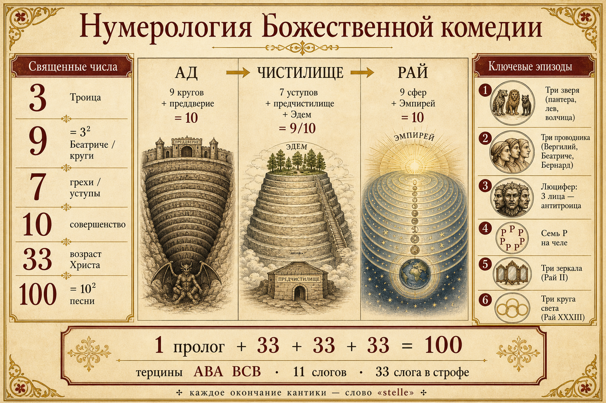
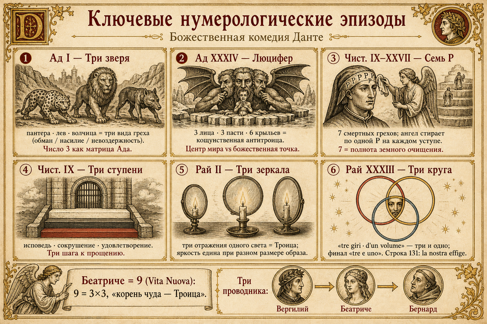

# Нумерология «Божественной комедии» Данте

Полный каталог числовой символики и ключевых эпизодов. Данте выстраивает поэму как богословскую архитектуру: числа не украшение, а каркас смысла.

## Инфографика

---

## I. Священные числа: словарь

| Число | Значение | Где проявляется |
|------:|----------|-----------------|
| **1** | Единство Божества | Формула «tre e uno»; точка (*punto*) как Бог |
| **2** | Движение, изменчивость | Фактор десятки (2×5=10) в *Рай* XXVII |
| **3** | Святая Троица | Кантики, терцины, проводники, звери, лица Люцифера… |
| **5** | «Число мира» | Второй фактор десятки у Беатриче |
| **7** | Полнота земного очищения | Уступы Чистилища, смертные грехи, буквы P, дни пути |
| **9** | Квадрат Троицы (3²); чудо | Круги Ада, сферы Рая, Беатриче |
| **10** | Совершенство / полнота | 100 песней (=10²); 10 отделов в каждом царстве |
| **11** | Преступление Закона (выход за 10) | Гендекасиллаб; мили Malebolge (11 и 22) |
| **33** | Возраст Христа; повтор цифры 3 | Песни каждой кантики; 33 слога в терцине |
| **100** | Квадрат совершенства | Общее число песней |

Данте сам объясняет логику девятки в *Vita Nuova* XXIX: девять = 3×3, а «единственный множитель чуда» — Троица («Padre e Figlio e Spirito Santo, li quali sono tre e uno»).

---

## II. Макроструктура поэмы

### 1. Три кантики + 100 песней
- **Ад** — 34 песни (1 пролог ко всей поэме + 33)
- **Чистилище** — 33
- **Рай** — 33  
Формула: **1 + 33 + 33 + 33 = 100**.

Сто — квадрат десяти, числа совершенства (*Convivio* II.xiv; *Vita Nuova* XXIX). Тридцать три отсылает к земным годам Христа.

### 2. Терцина (terza rima)
Строфа из трёх стихов со схемой **ABA BCB CDC…**. Каждый стих — итальянский **гендекасиллаб (11 слогов)** → в терцине **33 слога**. Микроуровень повторяет макроуровень: 3 × 11 и 33.

### 3. Общий объём
Около **14 233** стихов (классический подсчёт: Ад 4720, Чистилище 4755, Рай 4758). Сумма цифр 1+4+2+3+3 = **13** (= 1+3) — ещё один след формулы «один и три».

### 4. Одинаковый финал
Каждая кантика заканчивается словом **stelle** («светила / звёзды»): выход из Ада к звёздам; готовность подняться к звёздам; созерцание любви, движущей солнцем и другими звёздами.

### 5. Симметрия трёх царств по «десяткам»
В каждом царстве **девять** главных уровней + **десятый** предел:

| Царство | 9 уровней | 10-й предел |
|---------|-----------|-------------|
| Ад | 9 кругов | преддверие / входной порог |
| Чистилище | 7 уступов + предчистилище + Эдем (=9) | иногда берег считают отдельно → 10 |
| Рай | 9 движущихся сфер | Эмпирей (вне пространства и времени) |

---

## III. Эпизоды с подробным описанием

### А. Пролог и порог (*Ад* I–II)

#### 1. Середина жизненного пути (*Ад* I.1)
«Nel mezzo del cammin di nostra vita» — Данте **35 лет** (половина библейских 70; Пс. 90). Число отмечает кризис обращения: половина земного срока как точка выбора.

#### 2. Три зверя (*Ад* I)
Пантера (*lonza*), лев, волчица преграждают прямой подъём на холм. Классическая интерпретация (в т.ч. Ciardi и традиция комментариев):
- **волчица** — невоздержность (*incontinentia*);
- **лев** — насилие / зверство;
- **пантера** — обман / злоба (*fraus*).

Три зверя — числовой ключ ко всей этике Ада: три больших класса греха (круги 2–5 / 7 / 8–9).

#### 3. Три небесные заступницы (*Ад* II)
Цепочка милосердия: **Дева Мария → св. Лючия → Беатриче** → Вергилий. Три женских посредника спасения зеркалят Троицу на уровне благодати.

#### 4. Три проводника всего пути
1. **Вергилий** — человеческий разум / философия (Ад + Чистилище);
2. **Беатриче** — откровение / божественная любовь (Рай);
3. **св. Бернард** — созерцательная молитва (финал Рая).

Путь спасения нумерологически троичен: ratio → revelatio → contemplatio.

---

### Б. Ад: девять кругов и антитроица

#### 5. Девять кругов Ада
1. Лимб (некрещёные / добродетельные язычники)  
2. Похоть  
3. Чревоугодие  
4. Скупость и расточительность  
5. Гнев (и уныние в Стиксе)  
6. Ересь  
7. Насилие (три пояса: против ближнего / себя / Бога и природы)  
8. Обман: **Malebolge — 10 рвов**  
9. Предательство: **Коцит** (4 зоны)

Круг 7 сам троичен (три пояса); круг 8 даёт **десятку** рвов; круг 9 — **четверицу** видов предательства. Над всем — матрица **3 классов зла**.

#### 6. Мили Malebolge (11 и 22)
Окружности рвов указаны как **11** и **22** мили. Рене Генон и другие отмечали связь с **11** (выход за совершенную десятку Закона = знак греха) и с размером стиха (11 слогов). 22 = 2×11.

#### 7. Люцифер — антитроица (*Ад* XXXIV)
В центре Земли — гигант во льду:
- **3 лица** разных цветов (красное, желтовато-белое, чёрное);
- **3 пасти**, жующие **Иуду, Брута и Кассия**;
- **6 крыльев** (бывшие серафимские), **6 глаз**, из которых текут слёзы.

Это кощунственное зеркало Троицы: вместо всемогущества / всеведения / любви — бессилие, неведение, ненависть. Геометрический **центр мира** (сатана) противостоит позже **безразмерной точке Бога** (*punto*) в Раю.

---

### В. Чистилище: семёрка и тройка очищения

#### 8. Архитектура горы = 7 + 2 (+ берег)
- берег / предчистилище (ожидающие);
- **7 уступов** семи смертных грехов;
- Земной рай (Эдем) на вершине.

Семь уступов по учению Вергилия (*Чист.* XVII) делятся на **три** искажения любви:
1. любовь к дурному (гордость, зависть, гнев);
2. недостаточная любовь (лень);
3. чрезмерная любовь к благу (скупость, чревоугодие, похоть).

#### 9. Три ступени врат (*Чист.* IX)
У врат Чистилища — три ступени:
1. белая (как зеркало) — ясность самопознания / исповеди;
2. тёмная, треснувшая — сокрушение сердца;
3. кроваво-красная — удовлетворение / любовь, готовая к жертве.

Ангел-привратник чертит на челе Данте **семь P** (*peccatum*).

#### 10. Семь букв P
На каждом уступе ангел стирает одну P и произносит соответствующую заповедь блаженства. Семёрка — полнота очищения воли.

#### 11. Три сна и три ночи на горе
Данте трижды спит на Чистилище и видит **три вещих сна** (в т.ч. орёл / Ганимед; сирена; Лия и Рахиль). Число снов рифмуется с троичным ритмом восхождения.

#### 12. Временна́я рамка ~7 дней
Путешествие начинается в Великую пятницу 1300 г.; на берег Чистилища Данте выходит утром Пасхи; подъём занимает несколько суток. Семёрка связывает хронотоп пути с недельным циклом творения и Страстной недели.

---

### Г. Рай: девятка сфер и формула «три и одно»

#### 13. Девять сфер + Эмпирей
Луна → Меркурий → Венера → Солнце → Марс → Юпитер → Сатурн → Неподвижные звёзды → Перводвигатель (*Primo Mobile*) → **Эмпирей**.

Девять сфер управляются **девятью чинами ангелов**. Десятое небо — покой вне места и времени.

#### 14. Беатриче как «девятка»
Наследие *Vita Nuova*: встреча в 9 лет, снова через 9 лет, знамения в 9-й час; смерть Беатриче окружена календарной символикой девятки. В *Комедии* она — воплощённое чудо, чей «корень» — Троица (3²).

Появление Беатриче: *Чист.* XXX.31–33 (снова стык 3 и 1/30). Исследователи отмечают и другие совпадения строк/упоминаний имени с паттерном 13 / 31 / 133.

#### 15. Эксперимент с тремя зеркалами (*Рай* II)
Беатриче предлагает мысленный опыт: свеча и **три зеркала** на разном расстоянии. Отражения разного размера, но **одинаковой яркости**.  
Смысл: множественность тварей не уменьшает единый свет; зрительно и драматургически — **три отражения одного света** (троичный образ) + намёк на крест осей.

#### 16. Экзамен на три богословские добродетели (*Рай* XXIV–XXVI)
В сфере неподвижных звёзд Данте экзаменуют:
- **Пётр** — вера;
- **Иаков** — надежда;
- **Иоанн** — любовь.

Три добродетели = условие входа в созерцание Бога. Исповедание: «credo una essenza sì una e sì trina» (*Рай* XXIV.140) — прямая формула «одна сущность, столь единая и столь троичная».

#### 17. Факторизация десятки (*Рай* XXVII.115–117)
Беатриче: движение Перводвигателя измеряет все прочие, «как десять измеряется половиной и пятой» (**2 и 5**).  
Толкование (Moevs и др.): 10 = совершенство Эмпирея; 2 = движение/двойственность; 5 = «мир». Совершенство «разлагается» на мир и движение, но само восходит к единице.

#### 18. Божественная точка и девять кругов ангелов (*Рай* XXVIII)
Данте видит ослепительную **точку** (*punto*), вокруг которой вращаются девять концентрических кругов ангельских чинов. Чем ближе к точке — тем быстрее вращение (обратная перспектива к земной астрономии). Точка — Бог; контраст с «точкой» сатаны в центре Земли.

#### 19. Финальное видение: три круга одного объёма (*Рай* XXXIII)
Кульминация поэмы:
- три круга (*tre giri*) одного размера, разных цветов;
- во втором круге — человеческий лик (*la nostra effige*, ст. **131** — снова 1 и 3);
- ум паломника не может «снять» квадратуру круга воплощения — и его «внезапно озаряет молния» воли, движимой любовью.

Это окончательная нумерологическая теофания: **tre e uno**.

Исследователи формулы «tre e uno» отмечают, что финальное видение занимает порядка **100** стихов кантики (3×33+1) — снова совершенство, собранное из троицы плюс единица.

---

## IV. Сводная карта «самых значимых» узлов

1. **Макроформула 1+33+33+33=100** — каркас всей поэмы.  
2. **Терцина 3×11=33** — стих как микрохрам.  
3. **Три зверя → три класса греха** — этический код Ада.  
4. **9 кругов / 9 сфер / 9 зон Чистилища** — квадрат Троицы в космосе.  
5. **Люцифер с 3 лицами** — антитроица в геометрическом центре.  
6. **7 уступов и 7 P** — полнота очищения.  
7. **Три ступени врат** — сакраментальная троица покаяния.  
8. **Беатриче = 9** — чудо как 3².  
9. **Три зеркала** — оптика единого света.  
10. **Три круга света в Раю XXXIII** — финал «три и одно».

---

## V. Источники и ориентиры

- Dante, *Vita Nuova* XXIX (Беатриче и число 9; «tre e uno»).
- Princeton Dante Project / Toynbee, статья *Comedìa* (100 песней, терцина, объём).
- Charles Singleton, «The Poet’s Number at the Center».
- Christian Moevs, *The Metaphysics of Dante’s Comedy* (2, 5, 10; *punto*).
- Рене Генон, *Эзотеризм Данте*, гл. о символических числах (11, 22, 33).
- Исследования формулы «tre e uno» в *Commedia* (соположения 3 и 1 в структуре и счёте строк).
- Стандартные схемы этики: три класса зла в Аду; три порчи любви в Чистилище (*Чист.* XVII).

---

*Материал собран как справочный каталог для чтения «Божественной комедии» через призму средневековой нумерологии.*
