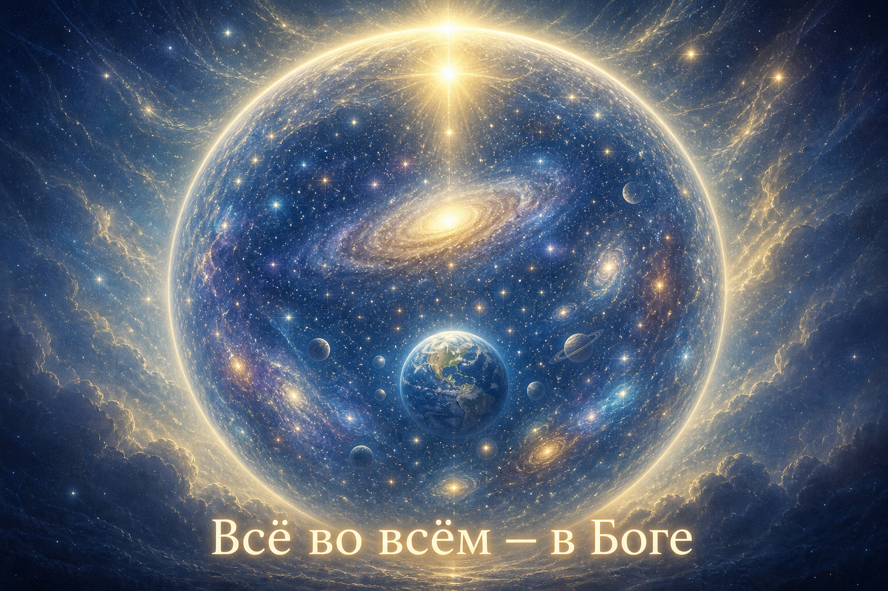
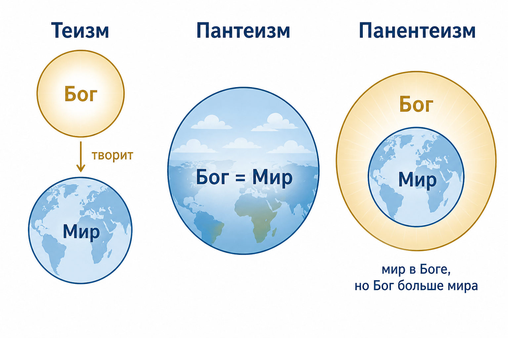
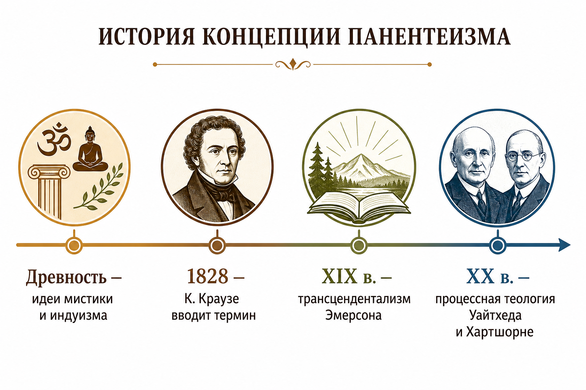
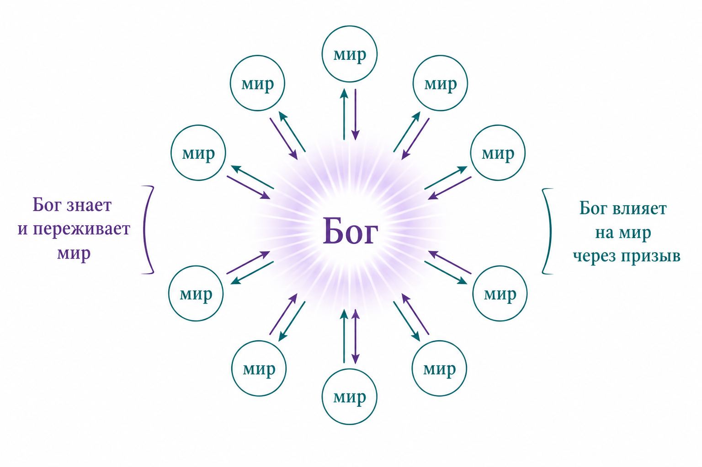

# Реферат: Панентеизм

**Тема:** Панентеизм как философско-религиозное учение  
**Формат:** обзор для широкой аудитории  
**Дата:** 2 августа 2026 г.

---

## Содержание

1. [Введение](#введение)
2. [Что означает слово «панентеизм»](#что-означает-слово-панентеизм)
3. [Главная идея простыми словами](#главная-идея-простыми-словами)
4. [Сравнение с другими взглядами на Бога](#сравнение-с-другими-взглядами-на-бога)
5. [История понятия](#история-понятия)
6. [Основные направления и мыслители](#основные-направления-и-мыслители)
7. [Процессный панентеизм](#процессный-панентеизм)
8. [Панентеизм в религиях и культуре](#панентеизм-в-религиях-и-культуре)
9. [Сильные стороны и критика](#сильные-стороны-и-критика)
10. [Заключение](#заключение)
11. [Источники](#источники)

---

## Введение

Люди давно задаются вопросом: **как связаны Бог (или высшее начало) и мир вокруг нас?** Одни считают, что Бог живёт «над» миром и почти не смешивается с ним. Другие утверждают, что Бог и мир — это одно и то же. **Панентеизм** предлагает третий, промежуточный ответ:

> **Мир находится внутри Бога, но Бог не сводится только к миру.**

Это учение пытается совместить две интуиции, которые многим кажутся важными:

- Бог **близок** к миру — присутствует в каждой вещи;
- Бог **больше** мира — не исчерпывается им полностью.

---

## Что означает слово «панентеизм»

Термин происходит от древнегреческих слов:

| Часть слова | Значение |
|-------------|----------|
| *pan* (πᾶν) | всё |
| *en* (ἐν)   | в |
| *theos* (Θεός) | Бог |

**Панентеизм** = «**всё в Боге**».

Обратите внимание на разницу с **пантеизмом** (*pan* + *theos* = «всё есть Бог»). В пантеизме Бог и мир часто отождествляют. В панентеизме добавляется маленькое, но принципиальное слово **«в»** — и смысл меняется: мир **находится в** Боге, а не **равен** ему.

Термин в современном виде ввёл немецкий философ **Карл Краузе** (К. Ф. Краузе) в **1828 году**. Он хотел найти мост между классическим теизмом (Бог отдельно от мира) и пантеизмом (Бог = мир).

---

## Главная идея простыми словами

Представьте **океан и рыбу**:

- Рыба **находится в** океане — без него она не существует.
- Но рыба **не равна** океану — океан намного больше, чем одна рыба или даже всё стадо рыб вместе.

Панентеизм часто объясняют похожей картинкой: **мир — как содержимое внутри Бога**, а **Бог — как безграничная среда**, которая включает мир, но простирается дальше.

Другая популярная аналогия (особенно в западной философии XX века):

> **Вселенная — «тело» Бога, а Бог — «сознание» или «душа», связанная с этим телом.**

Это не значит, что Бог буквально похож на человека. Это **наглядный образ** для объяснения: мир и Бог связаны очень тесно, но не тождественны.



*Рис. 1. Наглядная модель панентеизма: мир «внутри» Бога, но Бог шире мира.*

---

## Сравнение с другими взглядами на Бога

Чтобы понять панентеизм, полезно сравнить его с близкими учениями.



*Рис. 2. Три основных способа понимать связь Бога и мира.*

### Классический теизм

**Простая формула:** Бог **создал** мир и существует **отдельно** от него.

- Бог — трансцендентен (находится «выше» и «вне» мира).
- Мир — конечное творение.
- Бог может вмешиваться в мир (чудеса, откровение), но он не «растворён» в нём.

*Пример из быта:* архитектор и дом — архитектор создал дом, живёт не в стенах, но может вернуться и что-то изменить.

### Пантеизм

**Простая формула:** Бог **и** мир — **одно целое**.

- Бог **присутствует в мире** полностью.
- Часто говорят: «Бог = Природа» или «Бог = Вселенная».
- Известные связанные имена: некоторые читают так **Спинозу**, **Гераклита**, стоиков.

*Пример из быта:* океан и волна — волна не «отдельна» от океана, она есть сам океан в движении.

### Панентеизм

**Простая формула:** Мир **в** Боге, но Бог **больше** мира.

- Бог одновременно **присутствует в мире** и **превосходит его**.
- Мир не исчерпывает Бога.
- Бог может быть личностным — то есть способным к отношениям, любви, ответу.

*Пример из быта:* человек и его тело — тело «в» человеке, но личность не сводится только к телу; при этом они тесно связаны.

### Деизм (для полноты картины)

**Простая формула:** Бог **создал** мир, но **не вмешивается** в его ход.

Панентеизм от деизма отличается тем, что **подчёркивает постоянное присутствие** Бога в мире и возможность живого взаимодействия (молитва, откровение, влияние на события).

| Учение | Бог и мир | Бог больше мира? | Бог внутри мира? |
|--------|-----------|------------------|------------------|
| Классический теизм | Бог создал мир, они разделены | Да | Частично (может действовать в мире) |
| Деизм | Бог создал и «отошёл в сторону» | Да | Нет (обычно) |
| **Панентеизм** | **Мир в Боге** | **Да** | **Да** |
| Пантеизм | Бог = мир | Нет (в строгом смысле) | Да (полностью) |

---

## История понятия

Идеи, близкие к панентеизму, встречаются **задолго до** появления самого слова. Но как **отдельный термин** учение оформилось в XIX веке.



*Рис. 3. Упрощённая историческая линия развития идеи.*

### До появления термина

Мыслители и традиции, в которых находят **«зародыши»** панентеистических идей:

- **Неоплатонизм** (Плотин) — Единое превосходит мир, но мир «исходит» из него.
- **Христианская мистика** — образы, где душа «покоится в Боге», а Бог присутствует во всём творении.
- **Индуизм** (например, **Рамануджа**) — Брахман включает мир, но не сводится к нему.
- **Средневековые авторы** — Августин, Иоанн Скот Эриугена обсуждали близкие темы.

Важно: историки спорят, можно ли называть древние тексты «панентеизмом» в современном смысле. Чаще говорят: **в них есть элементы**, которые позже получили это название.

### XIX век: рождение термина

**Карл Краузе (1828)** предложил «панентеизм» как способ **примирить** монотеизм (веру в одного Бога) и пантеизм. По его замыслу:

- Вселенная **покоится в Боге**;
- Мир — **способ проявления** Бога;
- Но Бог **не растворяется** в мире.

В США идеи, близкие к панентеизму, поддерживали представители **трансцендентализма** — например, **Ральф Уолдо Эмерсон**, который видел божественное в природе, не отождествляя его полностью с материей.

### XX век: процессная философия

Наиболее развитую современную форму панентеизма дали **Альфред Норт Уайтхед** и **Чарльз Хартшорн**. Их подход называют **процессным панентеизмом** — о нём подробнее в отдельном разделе.

---

## Основные направления и мыслители

### Карл Краузе (1781–1832)

Немецкий философ, ученик И. Г. Фихте. Ввёл термин и заложил программу: **не отождествлять** Бога с миром, но и **не отрывать** их друг от друга.

### Рамануджа и индуистский контекст

В индуизме учение **вишишта-advaita** (условное единство) — Брахман — высшая реальность, а мир — его «тело» или проявление. Брахман **включает** всё сущее, но остаётся **больше** любой отдельной вещи.

Это один из частых примеров, когда западные исследователи говорят о **«восточном панентеизме»**. Следует помнить: индуистские категории не всегда точно совпадают с христианскими или западными — это **близкие**, но не тождественные модели.

### Христианская мистика

В мистической традиции часто встречается мысль: **душа обретает покой в Боге**, а Бог **присутствует** во всём созданном. Многие богословы видят здесь **родство** с панентеизмом, хотя классическое христианское богословие обычно ближе к теизму.

### Чарльз Хартшорн (1897–2000)

Американский философ, главный популяризатор термина в XX веке. Он писал, что **«мир — тело Бога»**: не в буквальном анатомическом смысле, а как **образ включения** — всё происходящее «находится в» божественной жизни.

---

## Процессный панентеизм

Самая влиятельная современная версия панентеизма связана с **процессной философией** Уайтхеда и Хартшорн.



*Рис. 4. Процессный панентеизм: двусторонняя связь между Богом и миром.*

### Базовые идеи

1. **Реальность — это процесс, а не застывшая «вещь».** Всё постоянно меняется и «становится».
2. **Бог тоже в процессе** — не «каменная статуя», а живая реальность, которая **развивается** вместе с миром.
3. **Мир в Боге:** Бог «собирает» и **переживает** всё, что происходит во Вселенной.
4. **Бог влияет на мир** — не как тиран, а как **призыв**, «манящий замысел» (у Уайтхеда — *initial aim*), который предлагает лучшие возможности, но **не отменяет свободу** существ.

### Два «полюса» Бога у Уайтхеда (упрощённо)

| Аспект | Что означает |
|--------|--------------|
| **Первичная природа** (primordial) | Бог как источник возможностей, идеалов, «шаблонов» хорошего |
| **Последующая природа** (consequent) | Бог как тот, кто **принимает** и **переживает** всё, что произошло в мире |

Известная фраза Уайтхеда: **«Бог — сотрапевец, который понимает»** (*God is the fellow sufferer who understands*). Бог не остаётся равнодушным наблюдателем — он **сочувствует** переживаниям мира.

### Чем процессный панентеизм отличается от классического теизма

- Бог **не всемогущ** в смысле «может всё, что угодно, в любой момент» — часть реальности **свободна** и непредсказуема.
- Бог **меняется**: узнаёт новое из опыта мира (хотя его **характер** — любовь, доброта — остаётся постоянным, по Хартшорн).
- Бог **не «над миром»** как далёкий правитель, а **внутри** него — но **шире** его.

---

## Панентеизм в религиях и культуре

Панентеизм — **не отдельная «церковь»**, а **способ мыслить** о Боге и мире. Его элементы можно встретить в разных контекстах:

| Область | Как проявляется |
|---------|-----------------|
| **Христианство** | В мистике, либеральном богословии, экотеологии («Бог в природе, но не только природа») |
| **Индуизм** | В традициях, где Высшее включает мир |
| **Новая мысль** (New Thought) | Идея божественного присутствия во всём, с акцентом на духовный рост |
| **Экологическая этика** | Мир священен, потому что **в** Боге; природа не «мертвая материя» |
| **Философия сознания** | Некоторые современные авторы используют панентеистические модели для связи сознания и космоса |

### Простая схема: где «живёт» панентеизм

```
        ТЕИЗМ ←———————— ПАНЕНТЕИЗМ ————————→ ПАНТЕИЗМ
   (Бог отдельно)     (мир в Боге,          (Бог = мир)
                       Бог больше)
              ↑
           ДЕИЗМ
    (Бог создал и не вмешивается)
```

Панентеизм занимает **центральное положение**: он **тянется** к теизму (Бог больше мира, может быть личностным) и к пантеизму (Бог очень близок миру, присутствует в нём).

---

## Сильные стороны и критика

### Почему идея привлекательна

1. **Согласует две интуиции:** божественная близость **и** божественная величина.
2. **Объясняет присутствие Бога** в мире без полного слияния с материей.
3. **Допускает живые отношения** — молитву, любовь, ответственность — в отличие от «холодного» деизма.
4. **Экологический смысл:** если мир «в Боге», уничтожение природы — не безразличный поступок.
5. **Философская гибкость:** хорошо стыкуется с идеей изменения, процесса, развития.

### Основные возражения

| Критика | Суть |
|---------|------|
| **Размывание трансцендентности** | Скептики говорят: если Бог так близок миру, чем он отличается от пантеизма? |
| **Проблема зла** | Если всё «в Боге», как объяснить страдание и зло? (Процессные теологи отвечают: мир частично свободен, Бог не контролирует всё.) |
| **Всеведение и изменение** | Если Бог «узнаёт» новое из мира, сохраняется ли классическое всеведение? |
| **Всемогущество** | Процессный панентеизм **ограничивает** всемогущество — для одних это честно, для других — неверно. |
| **Терминологическая путаница** | Слово «панентеизм» используют по-разному; без контекста легко ошибиться в понимании. |

---

## Заключение

**Панентеизм** — это учение о том, что **весь мир находится в Боге**, но **Бог не исчерпывается миром**. Он пытается ответить на вопрос, который волнует и верующих, и философов: *можно ли быть близко к божественному, не теряя его величия?*

**Ключевые выводы:**

1. **Этимология (происхождение слова):** «всё **в** Боге» — не «всё **есть** Бог».
2. **Позиция:** между классическим теизмом и пантеизмом.
3. **Два полюса:** присутствие Бога в мире + превосходство Бога над миром.
4. **Самая разработанная форма:** процессный панентеизм (Уайтхед, Хартшорн) — Бог и мир **взаимно влияют** друг на друга.
5. **Практический смысл:** мир не «пустой механизм», а нечто, **связанное** с высшим началом — это находит отклик в мистике, экологии и современной философии религии.

Панентеизм не даёт простых ответов на все вопросы — и, возможно, не должен. Его ценность в том, что он **удерживает напряжение** между близостью и отдалённостью, между священным в повседневном мире и Богом, который **больше** любой формулы.

---

## Источники

1. Панентеизм — Википедия: https://ru.wikipedia.org/wiki/Панентеизм  
2. ПАНЕНТЕИЗМ — Православная энциклопедия: https://pravenc.ru/text/панентеизм.html  
3. Panentheism — Stanford Encyclopedia of Philosophy (Process Theism): https://plato.stanford.edu/entries/process-theism/  
4. Panentheism — Wikipedia (English): https://en.wikipedia.org/wiki/Pan-en-Theism  
5. Process Philosophy — Internet Encyclopedia of Philosophy: https://iep.utm.edu/processp/  
6. Panentheism — Encyclopedia.com: https://www.encyclopedia.com/philosophy-and-religion/christianity/christianity-general/panentheism  

---

*Реферат подготовлен с использованием широко доступных академических и энциклопедических источников. Термины изложены в упрощённом виде для начального ознакомления с темой.*
