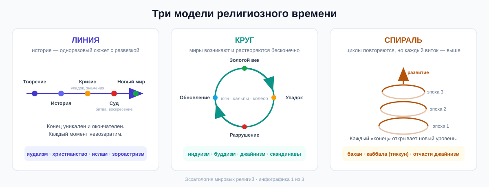

# Эсхатология мировых религий: как человечество представляет конец времён

> **Эсхатология** (от греч. *ἔσχατος* — «последний» и *λόγος* — «учение») — это раздел религиозной мысли о «последних вещах»: конце мира, конце истории и посмертной судьбе человека.

Реферат охватывает эсхатологические нарративы основных мировых религий и их ответвлений, изложенные доступным языком, а затем анализирует **точки конвергенции** — устойчивые общие мотивы, которые повторяются в традициях, разделённых тысячами километров и лет. Текст сопровождается инфографикой (раздел [Инфографика](#инфографика)).

---

## Содержание

1. [Два ключевых различения](#два-ключевых-различения)
2. [Часть I. Авраамические религии](#часть-i-авраамические-религии)
   - [Иудаизм](#иудаизм)
   - [Христианство](#христианство)
   - [Ислам](#ислам)
3. [Часть II. Иранская традиция: зороастризм](#часть-ii-иранская-традиция-зороастризм)
4. [Часть III. Дхармические религии](#часть-iii-дхармические-религии)
   - [Индуизм](#индуизм)
   - [Буддизм](#буддизм)
   - [Джайнизм](#джайнизм)
   - [Сикхизм](#сикхизм)
5. [Часть IV. Восточная Азия](#часть-iv-восточная-азия)
6. [Часть V. Другие традиции](#часть-v-другие-традиции)
7. [Часть VI. Точки конвергенции](#часть-vi-точки-конвергенции)
8. [Сравнительная таблица](#сравнительная-таблица)
9. [Инфографика](#инфографика)
10. [Что почитать](#что-почитать)

---

## Два ключевых различения

Прежде чем погружаться в конкретные традиции, полезно держать в голове две оси, по которым эсхатологии различаются.

**1. Личная и всеобщая эсхатология.**
*Личная* отвечает на вопрос «что будет со мной после смерти?» (рай, ад, перерождение, слияние с Абсолютом). *Всеобщая* — «чем закончится история мира?». Почти во всех религиях есть и то и другое, но акценты разные: авраамические религии делают ставку на всеобщий финал, дхармические — на личное освобождение из бесконечного круговорота.

**2. Модель времени: линия, круг или спираль.**

- **Линейное время** (иудаизм, христианство, ислам, зороастризм): у истории есть начало (творение), направление и один окончательный финал. Конец — это не катастрофа ради катастрофы, а *развязка сюжета*: суд, воздаяние и преображение мира.
- **Циклическое время** (индуизм, джайнизм, буддизм, скандинавская мифология): миры возникают и растворяются бесконечно, как вдох и выдох. «Конец света» — лишь конец очередного цикла, за которым неизбежно следует новый.
- **Спиральное время** (бахаи, отчасти каббала и джайнизм): циклы повторяются, но каждый виток несёт развитие — история движется вверх, а не по кругу.

---

## Часть I. Авраамические религии

### Иудаизм

Иудаизм — исторический источник линейной эсхатологии для половины человечества. Уже пророки Танаха (VIII–VI вв. до н. э.) говорят о **«Дне Господнем»** — дне, когда Бог вмешается в историю, накажет зло и восстановит справедливость.

Классическая (раввинистическая) картина складывается из нескольких элементов:

- **Машиах** («помазанник», отсюда греч. «мессия») — не бог и не сверхъестественное существо, а праведный царь из рода Давида. Он соберёт евреев из рассеяния, восстановит Храм в Иерусалиме и установит эпоху всеобщего мира: «перекуют мечи на орала» (Исаия 2:4). В некоторых текстах ему предшествует **Машиах бен Йосеф** — воин-предтеча, который погибнет в битве.
- **Война Гога и Магога** (Иезекииль 38–39) — финальное нашествие народов на Израиль, которое Бог сокрушит. Этот образ потом унаследуют христианство и ислам.
- **Тхият ха-метим** — воскресение мёртвых: праведники телесно восстанут для жизни в обновлённом мире.
- **Олам ха-ба** («грядущий мир») — состояние бытия после мессианской эры, о котором мудрецы Талмуда сознательно говорят скупо: «ни один глаз не видел этого».

Важная особенность: иудейский «конец времён» — это **не разрушение мира, а его исправление**. Земля не сгорает, история не обнуляется — она достигает цели.

**Ответвления и течения:**

- **Ортодоксальный иудаизм** ждёт личного Машиаха буквально; вера в его приход — один из 13 принципов веры Маймонида («и хотя он медлит, я каждый день буду ждать его»).
- **Реформистский иудаизм** (с XIX в.) заменил личность на процесс: не Машиах-человек, а **мессианская эра**, которую человечество приближает этическим действием.
- **Каббала** (особенно лурианская, XVI в.) предложила драматическую космологию: при творении «сосуды» божественного света разбились, и искры святости рассыпались по миру. Задача человека — **тиккун олам**, «исправление мира»: каждым праведным поступком возвращать искры на место. Когда исправление завершится, придёт Машиах. Конец света здесь — итог миллиардов маленьких человеческих усилий.
- **Хасидизм** усилил ожидание близкого избавления; в движении **Хабад** конца XX в. часть последователей увидела Машиаха в своём лидере — Любавичском Ребе Менахеме-Мендле Шнеерсоне, — и мессианские настроения там живы до сих пор.

### Христианство

Христианство родилось как эсхатологическое движение внутри иудаизма: первые христиане были уверены, что живут в последние времена и Иисус — тот самый Машиах (греч. *Христос*). Поскольку Мессия пришёл, но мир очевидно не преобразился, христианская эсхатология раздвоила событие: **Первое пришествие** уже произошло, **Второе пришествие (Парусия)** ещё впереди.

Общая для всех конфессий канва (главный источник — **Откровение Иоанна Богослова**, или Апокалипсис, ок. 95 г. н. э.):

1. Перед концом наступают **«последние времена»**: войны, лжепророки, охлаждение любви, вселенская проповедь Евангелия.
2. Приходит **Антихрист** — обманщик, который выдаст себя за спасителя и возглавит богоборческий миропорядок.
3. Христос возвращается «с силою и славою великою»; происходит битва при **Армагеддоне** (от ивр. *Хар-Мегиддо* — реальный холм в Израиле).
4. **Воскресение мёртвых** — всех, а не только праведников.
5. **Страшный суд**: каждый судится по делам; книги раскрыты.
6. **«Новое небо и новая земля»** и **Новый Иерусалим** — преображённый мир, где «смерти не будет уже» (Откр. 21:4).

Камень преткновения — упомянутое в Откровении **Тысячелетнее царство** (миллениум): период, когда Христос царствует на земле. Как его понимать? Отсюда — главные расхождения ветвей:

- **Католицизм** и **православие** придерживаются **амилленаризма** (линия Августина): тысячелетие — символ нынешней эпохи Церкви, а не будущий земной режим. Никаких вычислений дат: «не ваше дело знать времена и сроки». Различие между ними — в личной эсхатологии: у католиков есть **чистилище** (промежуточное очищение душ), православие говорит осторожнее о «мытарствах» и молитве за усопших, чистилище как догмат отвергая.
- **Протестантизм** дал весь спектр. *Постмилленаризм* (популярный в XVIII–XIX вв.): мир будет постепенно христианизироваться, и Христос вернётся *после* золотого века — оптимистическая, «прогрессистская» эсхатология. *Премилленаризм*: мир будет деградировать, Христос вернётся *до* миллениума и установит его силой. В XIX в. Джон Нельсон Дарби создал **диспенсационализм** с идеей **Восхищения Церкви** (Rapture): верующие будут внезапно взяты на небо до (или посреди) семилетней Великой скорби. Эта схема, популяризованная американским евангелизмом, — источник большинства голливудских образов «внезапно исчезающих людей».
- **Адвентисты седьмого дня** выросли из движения Уильяма Миллера, вычислившего Второе пришествие на 1844 год. Когда оно не состоялось («Великое разочарование»), адвентисты переосмыслили дату: в 1844-м Христос начал на небесах **«следственный суд»** — разбор дел человечества, по завершении которого вернётся.
- **Свидетели Иеговы** учат, что в **1914 году** Христос невидимо воцарился на небе; Армагеддон близок, в нём погибнет нынешний порядок вещей; 144 000 избранных будут править с небес, остальные праведники получат **вечную жизнь в раю на земле**. Ада как вечных мук нет — грешники просто перестанут существовать.
- **Мормоны (Церковь Иисуса Христа святых последних дней)** добавили географии: перед Вторым пришествием Израиль будет собран, а **Новый Иерусалим (Сион) будет построен на американском континенте**; затем — миллениум и серия воскресений.

### Ислам

Эсхатология в исламе — не периферия, а один из столпов веры: вера в **Судный день (Яум ад-дин)** обязательна для каждого мусульманина, и Коран возвращается к теме Часа постоянно.

Сценарий (собранный из Корана и хадисов) удобно разделить на признаки и сам финал:

**Малые признаки Часа** — моральная и социальная деградация: исчезновение знания, распространение разврата и убийств, «нищие пастухи будут состязаться в постройке высоких зданий».

**Большие признаки** — цепь сверхъестественных событий:

- Приход **Махди** («ведомого [Богом]») — праведного вождя из потомков Пророка, который наполнит землю справедливостью, «как она была наполнена гнётом».
- Явление **Даджжаля** — исламского аналога Антихриста: одноглазого лжемессии, творящего ложные чудеса.
- **Нисхождение Исы (Иисуса)**: в исламе именно Иисус, вернувшись с небес, убивает Даджжаля. Иисус — центральная фигура и мусульманского конца времён, что удивляет многих.
- Нашествие **Яджуджа и Маджуджа** (Гога и Магога), выход Зверя из земли, восход солнца с запада, дым.

**Сам финал:** трубный глас — всё живое умирает; второй глас — **всеобщее воскресение**; каждому вручается книга его дел; дела взвешиваются на **весах (Мизан)**; все проходят по мосту **Сират**, «тоньше волоса и острее меча», натянутому над адом: праведники переходят в рай, грешники падают. Рай (**Джанна**) и ад (**Джаханнам**) описаны в Коране предельно чувственно и конкретно.

**Ответвления:**

- **Сунниты**: Махди — фигура будущего; он родится (или объявится) в конце времён. Учение опирается на хадисы, в самом Коране Махди не упомянут.
- **Шииты-двунадесятники** (Иран, Ирак): Махди **уже родился**. Это Мухаммад аль-Махди, двенадцатый имам, который в 874 году ушёл в **сокрытие (гайба)** и незримо живёт до сих пор, чтобы вернуться в назначенный час. Ожидание Скрытого имама — ядро шиитского благочестия и даже политической теории (иранская доктрина «велаят-е факих» — правление факиха *в отсутствие* имама).
- **Исмаилиты** пошли иначе: их линия имамов не прерывалась и продолжается по сей день (нынешний имам — Ага-хан), поэтому эсхатологическое напряжение снято: водительство уже присутствует в мире.
- **Ахмадийя** (XIX в., Индия): основатель Мирза Гулам Ахмад объявил себя одновременно обещанным Махди и Мессией — то есть пророчества *уже исполнились*, а Иисус, по учению ахмадийцев, умер естественной смертью в Кашмире. Большинством мусульман движение не признаётся.
- **Суфизм** переносит акцент внутрь: «умри до того, как умрёшь» — уничтожение эго (*фана*) есть личный апокалипсис, доступный уже сейчас.

---

## Часть II. Иранская традиция: зороастризм

Зороастризм (Иран, I тыс. до н. э.) — религия небольшая по числу нынешних последователей, но, вероятно, **самая влиятельная эсхатология в истории**: многие исследователи считают, что именно от неё иудаизм эпохи вавилонского плена и персидского владычества усвоил идеи воскресения мёртвых, финального суда, рая и ада, фигуры спасителя и космической войны добра со злом — а через иудаизм всё это унаследовали христианство и ислам.

Сюжет таков. История — это ограниченный по времени «боевой полигон», на котором благой творец **Ахура-Мазда** сражается с духом разрушения **Ангра-Майнью (Ахриманом)**. Мир сотворён именно для того, чтобы зло, ввязавшись в него, было побеждено *внутри времени*.

В конце времён от семени Заратуштры, чудесно сохранённого в озере, от девы родится спаситель — **Саошьянт** («тот, кто принесёт пользу»). Он воскресит всех мёртвых. Затем произойдёт **Фрашокерети** — «обновление мира»: расплавленный металл разольётся по земле рекой, и всё человечество пройдёт через неё. Для праведных поток будет «как парное молоко», грешников он очистит от зла — мучительно, но **не вечно**: зороастрийский ад — исправительный, а не бесконечный. В финале зло уничтожается *как таковое*, и все — подчеркнём, все — живут в совершенном мире вечно.

Зороастризм, таким образом, дал линейной эсхатологии её самую оптимистичную версию: финал без проигравших.

---

## Часть III. Дхармические религии

### Индуизм

В индуизме вопрос «когда наступит конец света?» лишён драматизма: концов света — бесконечное множество, и все они уже происходили.

Время устроено матрёшкой циклов:

- **Четыре юги** — эпохи внутри одного цикла, идущие по нисходящей: **Сатья-юга** (золотой век: добродетель «стоит на четырёх ногах»), Трета-юга, Двапара-юга и **Кали-юга** — «железный век» лжи, жадности и раздора, в котором, согласно традиции, мы живём сейчас (она началась в 3102 г. до н. э. и продлится 432 000 лет).
- В конце Кали-юги явится **Калки** — десятый и последний аватар бога Вишну: всадник на белом коне с пылающим мечом. Он уничтожит зло и адхарму, и колесо провернётся — начнётся новая Сатья-юга.
- На более высоком уровне — **пралайя**, растворение мира. Тысяча циклов юг составляют один день Брахмы (**кальпу**, 4,32 млрд лет); когда Брахма «засыпает», вселенная растворяется на ночь той же длины, а затем творится заново. Когда истекает жизнь самого Брахмы (311 триллионов лет), наступает **махапралайя** — великое растворение всего в Абсолюте... до следующего вдоха.

Конец света здесь — не приговор, а **дыхание вселенной**. Личная задача человека — не пережидать финал, а вырваться из колеса перерождений (**мокша**).

### Буддизм

Будда отказывался спекулировать о конце вселенной: мир для буддизма безначален, циклы разрушения (огнём, водой, ветром) и восстановления миров идут вечно. Но у буддизма есть собственный эсхатологический нерв — **судьба Учения**:

- **Упадок Дхармы**: учение Будды Гаутамы не вечно — оно будет постепенно забываться и в итоге исчезнет из мира. В Восточной Азии эта идея оформилась в концепцию **маппо** («последняя эпоха Дхармы»), в которую, как считали японские буддисты, мир вступил в 1052 году: люди уже не способны достичь пробуждения своими силами.
- Когда Дхарма будет полностью утрачена, в мир придёт **Майтрея** — будущий Будда, ныне ожидающий на небесах Тушита. Он заново откроет путь к пробуждению. Майтрея — самая близкая буддийская параллель мессии, и именно вокруг него веками возникали милленаристские движения по всей Азии.
- **Ветви.** *Тхеравада* относится к этому спокойно-хронологически: упадок займёт тысячелетия, торопиться некуда. *Махаяна* (особенно школы **Чистой земли** в Китае и Японии) сделала из маппо практический вывод: раз своими силами пробудиться нельзя, надо довериться будде **Амитабхе** и родиться в его Чистой земле — своего рода буддийская «личная эсхатология спасения верой». *Ваджраяна* (Тибет) хранит **Калачакра-тантру** с легендой о скрытой стране **Шамбале**: когда мир будет порабощён силами варварства, 25-й царь Шамбалы **Рудрачакрин** выйдет с воинством, разгромит их в последней битве и откроет золотой век Дхармы — сюжет, поразительно похожий на авраамический апокалипсис.

### Джайнизм

Джайнизм — самая радикально «антиэсхатологическая» из великих религий. Вселенная **никем не создана и никогда не будет разрушена**: она вечна и лишь пульсирует. Колесо времени состоит из двух полуоборотов: **авасарпини** (нисходящий — всё постепенно ухудшается: рост людей, продолжительность жизни, нравственность) и **утсарпини** (восходящий — всё улучшается), каждый по шесть «спиц»-эпох. Мы находимся в пятой спице нисходящего полуоборота — в эпохе упадка, когда в нашей части мира даже невозможно достичь полного освобождения. Но никакой финальной битвы, суда или спасителя не будет: колесо просто продолжит вращаться вечно. Единственный «конец света», который имеет значение, — личный: душа, достигшая освобождения (**мокши**), навсегда покидает колесо и пребывает в блаженстве на вершине вселенной.

### Сикхизм

Сикхизм (Пенджаб, XV в.) унаследовал индийскую циклическую рамку, но сознательно снизил эсхатологический градус: гуру учили не гадать о конце света, а жить честным трудом и памятованием о Боге. Миры творятся и растворяются по воле Единого (Вахегуру) бессчётное число раз; спекуляции о датах бесполезны. Центр тяжести — личное освобождение: выход из круга перерождений и слияние с Богом, достижимое ещё при жизни. Всеобщего финального суда и мессианской фигуры в классическом сикхизме нет.

---

## Часть IV. Восточная Азия

### Даосизм

У философского даосизма (Лао-цзы, Чжуан-цзы) эсхатологии нет — Дао вне времени. Но **религиозный даосизм** первых веков н. э. развил яркий милленаризм: ожидание того, что божественный Лао-цзюнь (обожествлённый Лао-цзы) вернётся в мир в образе мессии **Ли Хуна**, сметёт прогнивший порядок и установит эпоху Великого равновесия (**Тайпин**). Перед этим — катаклизмы, эпидемии и потопы, которые переживут лишь **«семенные люди» (чжунминь)** — праведный остаток, из которого вырастет новое человечество. Эти ожидания питали реальные восстания — от «Жёлтых повязок» (184 г.) до позднейших тайных обществ.

### Конфуцианство

Конфуцианство смотрит не вперёд, а назад-и-вперёд одновременно: золотой век уже был (эпоха совершенномудрых государей), и задача — вернуть его. Идеал **Датун** («Великое единение») из «Ли цзи» — мир, где «Поднебесная принадлежит всем», старики ухожены, сироты не брошены, двери не запирают. Это не апокалипсис, а **социальная эсхатология без сверхъестественного финала** — утопия, достижимая нравственным усилием. В XIX в. реформатор Кан Ювэй превратил Датун в программу поступательного движения человечества к всемирному единству.

### Китайский народный милленаризм

На стыке буддизма, даосизма и народной религии сложилась влиятельная схема **«трёх эпох»**: история делится на эры трёх будд, и нынешняя, испорченная, завершится приходом **Майтреи** (кит. Милэ). Секты традиции **Белого лотоса** добавили фигуру **Нерождённой Праматери (Ушэн Лаому)**, которая посылает спасителей за своими заблудшими детьми. Эти учения веками вдохновляли восстания — вплоть до тайпинов XIX в., чей лидер Хун Сюцюань объявил себя младшим братом Иисуса Христа (уже под христианским влиянием).

### Синто и новые религии Японии

Классический синтоизм — религия «вечного настоящего»: мифология подробно рассказывает о начале мира, но о его конце молчит. Эсхатологическую нишу в Японии заняли, во-первых, буддийская идея маппо, а во-вторых — «новые религии» XIX–XX вв. (Тэнрикё, Оомото и др.) с идеей **ёнаоси** — «выправления мира»: грядущего обновления, когда мир зла будет перестроен в мир радости.

---

## Часть V. Другие традиции

### Бахаи

Вера бахаи (Иран, XIX в.) предлагает элегантный ход: **эсхатология уже исполнилась**. «Конец света», обещанный всеми религиями, — не разрушение планеты, а символ конца старой религиозной эпохи; пророчества о Мессии, Махди и возвращении Христа исполнились в приходе Баба и **Бахауллы** (1817–1892). Откровение прогрессивно: Бог посылает учителей каждой эпохе, и через ~тысячу лет придёт следующий. Впереди у человечества — не катастрофа, а строительство **Величайшего мира**: единая федерация человечества, вспомогательный всемирный язык, гармония науки и религии. Это редкий случай последовательно **оптимистической, посюсторонней и уже начавшейся** эсхатологии.

### Растафари

Растафарианство (Ямайка, 1930-е) прочитало библейский Апокалипсис через опыт африканской диаспоры: **Вавилон** — это западный колониально-угнетательский порядок, и он обречён пасть; император Эфиопии **Хайле Селассие I** (тронное имя — Рас Тафари) — живое воплощение Бога (Джа) и вернувшийся мессия; избавление — **репатриация в Сион**, то есть в Эфиопию/Африку. Смерть Селассие в 1975 г. многими растафари отвергается или трактуется как «исчезновение»: мессия жив.

### Германо-скандинавское язычество: Рагнарёк

Скандинавский **Рагнарёк** («судьба богов») — самый знаменитый языческий апокалипсис. Сначала — **Фимбулвинтер**, трёхлетняя зима без лета; распадаются узы родства, «брат убивает брата». Освобождаются скованные чудовища: волк **Фенрир** проглатывает Одина, мировой змей **Ёрмунганд** сходится в смертельной схватке с Тором (убивают друг друга), огненный великан **Сурт** сжигает мир. Но это не конец: из моря поднимается новая зелёная земля, возвращается светлый бог **Бальдр**, а от укрывшейся пары людей — **Лив и Ливтрасира** — происходит новое человечество. Гибель богов оказывается ещё одним оборотом цикла. Современное неоязычество (асатру) обычно читает Рагнарёк как миф об обновлении, а не пророчество.

### Религии коренных народов

- **Хопи** (Северная Америка): человечество уже сменило три мира, разрушенных за отступление от законов Творца; мы живём в Четвёртом, и его завершение с переходом в Пятый мир близко. Ожидается возвращение **Паханы**, «истинного белого брата», который принесёт недостающий фрагмент священной скрижали.
- **Пляска Духов (Ghost Dance, 1889–1890)**: пророк-пайют Вовока учил, что если индейцы будут танцевать священный танец и жить праведно, мир обновится — вернутся умершие предки и стада бизонов, а колонизаторы исчезнут. Движение трагически оборвалось бойней при Вундед-Ни (1890) — хрестоматийный пример милленаризма как ответа на катастрофу народа.
- **Майя**: у древних майя было изощрённое циклическое летосчисление, но знаменитое «пророчество 2012 года» — современный миф: окончание 13-го бактуна означало смену календарного цикла, а не конец света.
- **Карго-культы Меланезии** (XX в.): ожидание кораблей/самолётов предков с «грузом» изобилия, который сметёт неравенство с белыми, — милленаризм, рождённый колониальным шоком.

### Древний Египет (историческая справка)

Даже в Египте, религии стабильности, есть поразительный эсхатологический фрагмент: в «Книге мёртвых» (гл. 175) бог Атум говорит, что в конце времён уничтожит всё созданное, и мир вернётся в первичный океан **Нун**, — а сам Атум останется со змеем Осирисом в виде двух змей. А египетское **взвешивание сердца** на весах против пера Маат — древнейший образ посмертного суда, отозвавшийся и в исламских «весах», и в христианской психостасии на иконах Страшного суда.

---

## Часть VI. Точки конвергенции

Теперь главное: если разложить все описанные нарративы на составные мотивы, обнаруживается устойчивый повторяющийся набор. Ниже — восемь основных точек конвергенции.

### 1. Моральный упадок как предвестие конца

Почти везде конец приходит не внезапно, а **по нарастающей деградации**: «охлаждение любви» в Евангелиях, малые признаки Часа в исламе (невежество, разврат, «пастухи строят небоскрёбы»), Кали-юга в индуизме, маппо в буддизме, пятая спица нисходящего полуоборота у джайнов, распад родственных уз перед Рагнарёком. Мир не взрывается — он **истощается нравственно**, и катастрофа лишь оформляет уже свершившийся внутренний распад.

### 2. Фигура спасителя

Самая яркая конвергенция — **эсхатологический избавитель**, приходящий в момент наибольшей тьмы:

| Традиция | Фигура |
|---|---|
| Иудаизм | Машиах |
| Христианство | Христос (Второе пришествие) |
| Ислам | Махди + Иса (Иисус) |
| Зороастризм | Саошьянт |
| Индуизм | Калки (аватар Вишну) |
| Буддизм | Майтрея; в Калачакре — Рудрачакрин |
| Даосизм | Ли Хун |
| Растафари | Хайле Селассие |
| Хопи | Пахана |

Повторяются даже детали: чудесное рождение (Саошьянт — от девы), всадник на белом коне (Калки — и Христос в Откр. 19:11), происхождение от священного рода (Махди — от Пророка, Машиах — от Давида).

### 3. Фигура обманщика

Зеркальный мотив — **лже-спаситель**, чьё явление предшествует настоящему: Антихрист, Даджжаль, в зороастризме — сам Ангра-Майнью, в индуизме — демон Кали (персонификация века лжи). Смысловая функция одинакова: последнее испытание — не сила зла, а его **правдоподобие**.

### 4. Финальная битва

Космический конфликт стягивается в одно решающее сражение: **Армагеддон**, война **Гога и Магога** (в двух религиях), **Фрашокерети**, выход воинства **Шамбалы**, **Рагнарёк**, битва Калки с демонами. Даже в «мирных» традициях (Пляска Духов) обновление мира предполагает устранение мира старого.

### 5. Суд и взвешивание

Идея, что финал — это **аудит**: египетское взвешивание сердца, исламский Мизан и книга дел, христианский Страшный суд с раскрытыми книгами, зороастрийский мост Чинват (и его исламский родственник Сират), в дхармических религиях — безличный, но неумолимый закон кармы, «встроенный судья», не требующий судебного заседания.

### 6. Воскресение и возвращение умерших

Телесное **воскресение всех мёртвых** — общая ось зороастризма, иудаизма, христианства и ислама (и почти наверняка иранское наследие в авраамических религиях). Тот же мотив независимо вспыхивает в Пляске Духов (возвращение предков) и в карго-культах. В религиях перерождения он не нужен: там мёртвые и так возвращаются — постоянно.

### 7. Очищение огнём и катаклизмом

Мир перед обновлением проходит стерилизацию: река расплавленного металла (зороастризм), «стихии, разгоревшись, разрушатся» (2-е Послание Петра), пламя Сурта, огонь пралайи, потопы и моры даосских пророчеств. Показательно, что огонь почти всюду **амбивалентен**: он и кара, и очищение — уничтожает не мир, а порчу мира.

### 8. Новый мир / золотой век

Финал почти никогда не является точкой: за ним — **обновлённое бытие**. Новое небо и новая земля, Олам ха-ба, Джанна, Фрашокерети («мир, сделанный прекрасным»), новая Сатья-юга, восходящая утсарпини, зелёная земля после Рагнарёка, Пятый мир хопи, Датун, Величайший мир бахаи. Апокалипсис в глубинной грамматике религий — это **не конец, а роды**: разрушение выступает механизмом обновления.

### Почему нарративы сходятся? Четыре объяснения

Конвергенция такого масштаба требует объяснения. В религиоведении их обычно четыре, и они не исключают друг друга:

1. **Генетическое родство.** Часть сходств — просто наследование: зороастризм → иудаизм плена → христианство и ислам (воскресение, суд, спаситель, дуализм финальной битвы). Индоиранские корни роднят зороастрийские и ведийские представления. Это объясняет «западный кластер», но не сходство с Калки, Майтреей или хопи.
2. **Культурная диффузия.** Мотивы путешествуют: Майтрея пришёл в китайский милленаризм из Индии; Пляска Духов и карго-культы впитали христианскую проповедь; образ Шамбалы формировался в регионе контакта буддизма с исламом. Часть «независимых» параллелей — на самом деле заимствования.
3. **Психологические универсалии.** Везде, где есть люди, есть опыт смерти и возрождения (день/ночь, зима/весна, зерно), жажда справедливости и потребность в теодицее — ответе на вопрос «почему зло торжествует?». Эсхатология — универсальный ответ: *пока* торжествует; сюжет ещё не кончился. Мирча Элиаде видел в этом архетип «вечного возвращения» — периодического обновления мира через ритуальное разрушение.
4. **Социальная функция.** Милленаризм закономерно вспыхивает у групп, переживающих кризис и депривацию: иудейские апокалипсисы — под властью империй, Пляска Духов — после разгрома индейских народов, карго-культы — при колониальном шоке, Белый лотос — в голодные годы. Эсхатология — это **язык надежды угнетённых** и одновременно инструмент моральной мобилизации: если финал близок и будет суд, то каждый поступок имеет вес.

### И важное различие, которое нельзя замазывать

При всей конвергенции традиции расходятся в главном — **в цене и статусе финала**:

- Для линейных религий конец **уникален и окончателен**: история — одноразовый сюжет с развязкой, и это придаёт каждому моменту невозвратимую серьёзность.
- Для циклических конец **рутинен**: он был и будет бессчётно, поэтому спасаться нужно не *в* истории, а *от* истории — из самого колеса.
- Бахаи и отчасти каббала предлагают третий путь — **спираль**: финалы повторяются, но каждый выводит на новый уровень.

Грубо говоря: авраамические религии ждут **спасения мира**, дхармические ищут **спасения от мира**, а спиральные модели — **спасения через миры**.

---

## Сравнительная таблица

| Традиция | Время | Спаситель | Антагонист | Ключевое событие | Что после |
|---|---|---|---|---|---|
| Иудаизм | линия | Машиах | Гог и Магог | Мессианская эра, воскресение | Олам ха-ба |
| Христианство | линия | Христос (2-е пришествие) | Антихрист | Армагеддон, Страшный суд | Новое небо и земля |
| Ислам | линия | Махди + Иса | Даджжаль | Кыямат, Мизан, Сират | Джанна / Джаханнам |
| Зороастризм | линия | Саошьянт | Ангра-Майнью | Фрашокерети, река металла | Совершенный мир для всех |
| Индуизм | круг | Калки | демон Кали | Конец Кали-юги, пралайя | Новая Сатья-юга |
| Буддизм | круг | Майтрея / Рудрачакрин | «упадок Дхармы» | Исчезновение и возврат Дхармы | Новая эпоха Дхармы |
| Джайнизм | круг | — | — | Смена полуоборотов колеса | Утсарпини (подъём) |
| Сикхизм | круг | — | — | Растворение миров по воле Бога | Новые творения; мукти |
| Даосизм (религ.) | круг | Ли Хун | демоны, моры | Катаклизм, отбор «семенных людей» | Эпоха Тайпин |
| Бахаи | спираль | Бахаулла (уже пришёл) | — | Смена религиозных эпох | Величайший мир |
| Скандинавы | круг | Бальдр (возвращение) | Фенрир, Сурт, Локи | Рагнарёк | Новая зелёная земля |
| Хопи | круг | Пахана | отступники от законов | Переход миров | Пятый мир |
| Растафари | линия | Хайле Селассие | Вавилон | Падение Вавилона | Сион (Африка) |

---

## Инфографика

В папке [`infographics/`](infographics/) — три SVG-схемы (открываются в браузере и рендерятся прямо на GitHub):

1. **[time-models.svg](infographics/time-models.svg)** — три модели религиозного времени: линия, круг, спираль.
2. **[eschaton-map.svg](infographics/eschaton-map.svg)** — обзорная карта: 12 традиций, их спасители, финальные события и «что после».
3. **[convergence-matrix.svg](infographics/convergence-matrix.svg)** — матрица: 8 общих мотивов × 10 традиций, наглядно показывающая зоны конвергенции.

---

## Что почитать

- **Мирча Элиаде.** «Миф о вечном возвращении» — о циклическом времени и архетипе обновления мира.
- **Норман Кон.** «В погоне за тысячелетием» (*The Pursuit of the Millennium*) — классика о средневековом милленаризме; его же *Cosmos, Chaos and the World to Come* — о зороастрийских корнях апокалиптики.
- **Мэри Бойс.** «Зороастрийцы. Верования и обычаи».
- **The Oxford Handbook of Eschatology** (ред. J. Walls) — академический обзор по всем традициям.
- **Дэмиен Томпсон.** «Конец времени» (*The End of Time*) — о психологии и социологии апокалиптических ожиданий.

---

*Дисклеймер: реферат — обзорный. Внутри каждой традиции существуют десятки школ и интерпретаций; здесь изложены наиболее репрезентативные версии по академическим обзорам религиоведения.*
