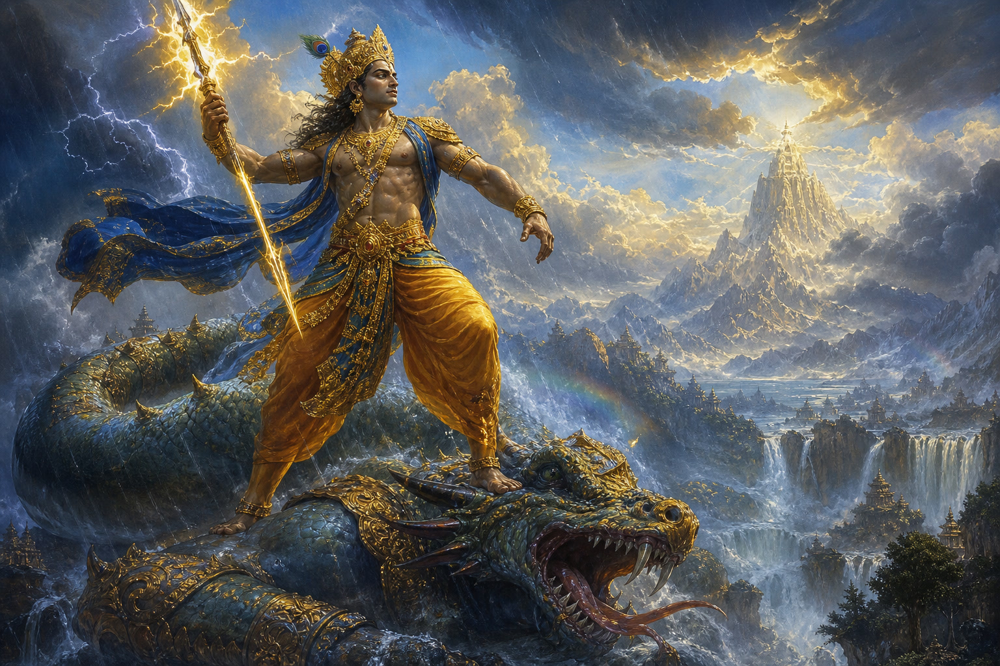
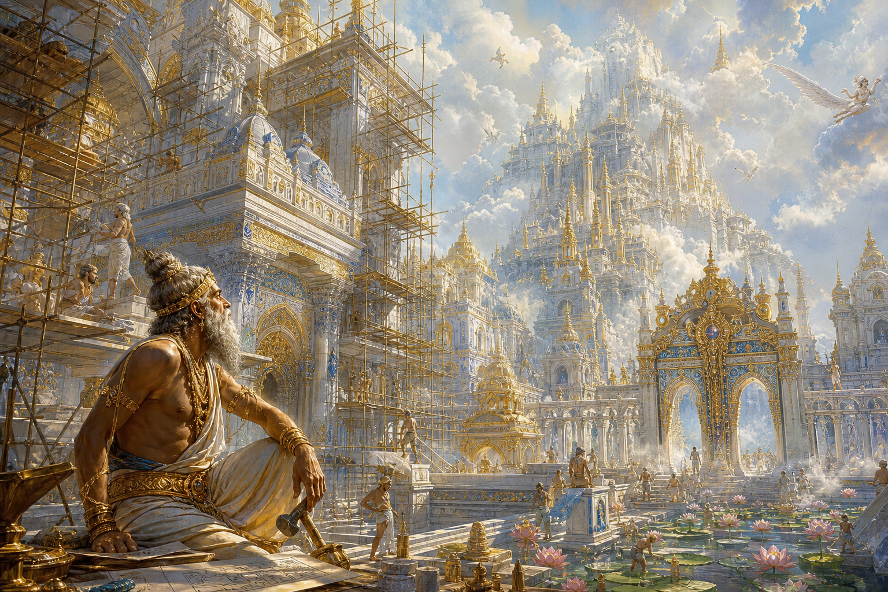
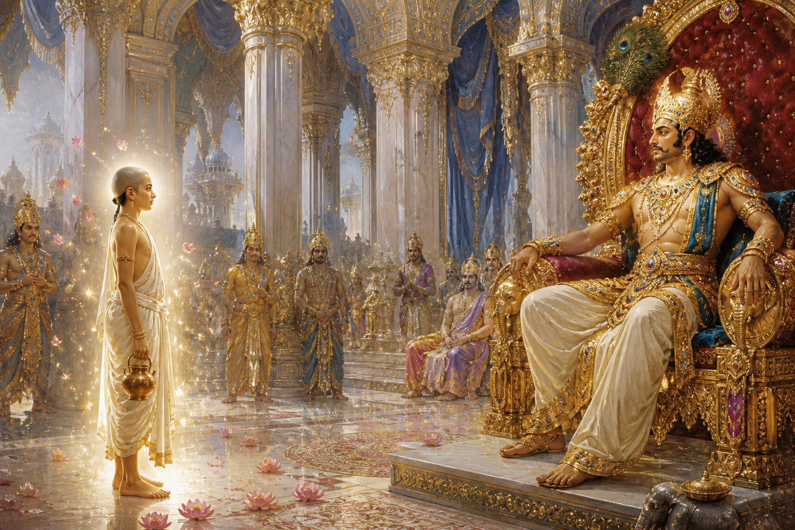
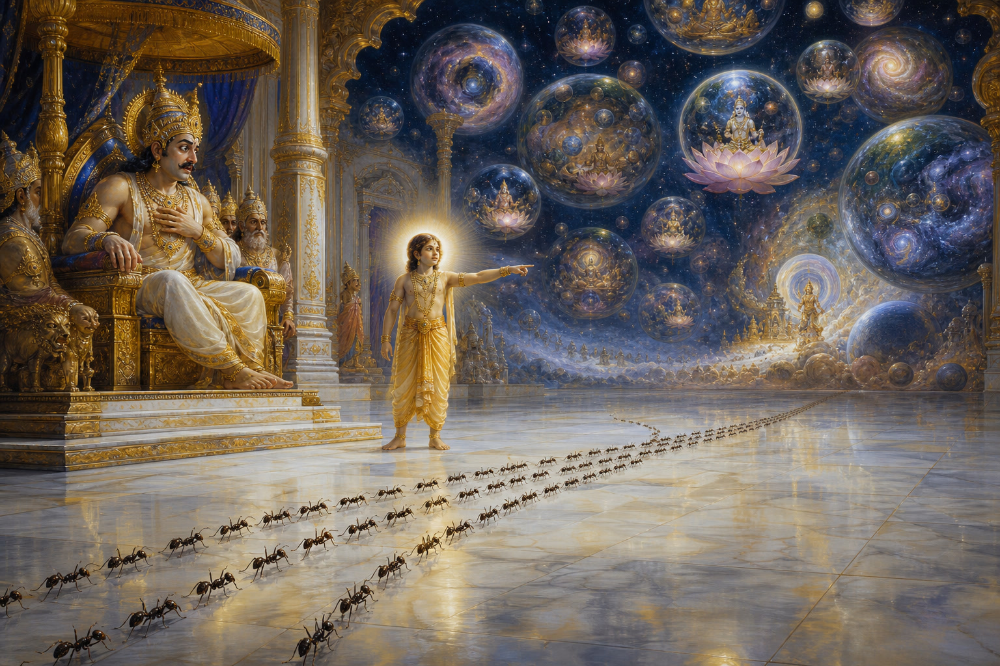
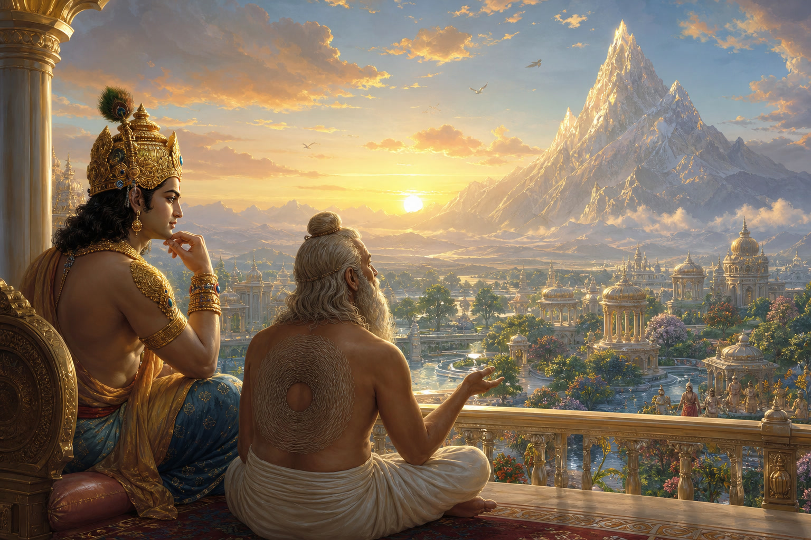

# Дом Индры: пересказ мифа

**Источник:** *Брахмавайварта-пурана* (Кришна-джанма-кханда, гл. 47 — «Сокрушение гордыни Индры»).  
Классический современный пересказ: Heinrich Zimmer, *Myths and Symbols in Indian Art and Civilization*; популяризован Джозефом Кэмпбеллом.

---

## О чём миф одной фразой

Царь богов строит всё более роскошный дворец — и узнаёт, что таких «Индр» было и будет бесконечно много, а гордыня превращает богов в муравьёв.

*Илл. 1. Индра разит Вритру ваджрой; воды снова текут по земле.*

---

## 1. Победа и «какой же я великий»

Жил-был **Индра** — царь богов, бог грозы и дождя. Однажды мир задыхался от засухи: демон **Вритра** перекрыл все воды. Индра взял своё оружие — **ваджру** (громовую стрелу), поразил чудовище, и реки снова хлынули на землю.

Мир ожил. Боги ликовали. А Индра подумал примерно так:

> «Какой же я великий. Такому герою нужен дворец, какого ещё не видел никто.»

Гордыня родилась не из злобы — из упоения победой. Так часто бывает и с людьми.

---

## 2. Дворец без конца

Индра призвал небесного зодчего **Вишвакармана** и велел построить дворец, достойный царя богов.

Вишвакарман трудился: белый мрамор, золотые шпили, сады, что меняются по желанию хозяина, врата, усыпанные драгоценными камнями. Дворец **Амаравати** на склонах космической горы Меру уже сиял, как солнце.

Но каждый раз, когда Индра приходил смотреть, он говорил:

> «Ещё одно крыло.»  
> «Ещё выше башни.»  
> «Ещё пышнее залы.»

*Илл. 2. Вишвакарман строит Амаравати — а требования Индры растут без конца.*

Вишвакарман понял: оба они бессмертны, а желания Индры — бездонны. Он устал и пошёл жаловаться **Брахме**, творцу. Брахма обратился к **Вишну** — тому, кто хранит мироздание. Вишну улыбнулся и сказал, что сам навестит гордеца.

---

## 3. Мальчик у ворот

Однажды у ворот дворца появился **брахман-мальчик** — светлый, спокойный, с голосом, в котором слышался гром далёкого горизонта. Это был Вишну в облике ребёнка.

Индра принял гостя с почётом.

— Я пришёл посмотреть на твой дворец, — сказал мальчик. — Говорят, ты строишь такой, **какого ещё ни один Индра не строил**.

Индра рассмеялся:

— «Ни один Индра»? Мальчик, сколько же Индр ты видел?

*Илл. 3. Вишну в облике мальчика входит в тронный зал Индры.*

---

## 4. Бесчисленные миры, бесчисленные Индры

Мальчик заговорил — и смех Индры погас.

Он рассказал о **kalpa** — огромных космических циклах: вселенные рождаются и гибнут, как пузыри на воде. В каждом мире есть свой Индра. В каждом веке — свой. Счёт Индр сравним разве что с пылью на земле: даже пылинки можно пересчитать, а Индр — нет.

Пока он говорил, по мраморному полу зала прошла **длинная колонна муравьёв**.

Мальчик рассмеялся.

— Почему ты смеёшься? — спросил Индра, уже неуверенно.

— Эти муравьи, — ответил гость, — **все когда-то были Индрами**. Каждый взошёл на трон, возгордился, и карма привела его сюда — в очередь крошечных ног по твоему полу.

*Илл. 4. Парад муравьёв: бывшие цари богов проходят по залу нынешнего Индры.*

Потом явился ещё один гость — аскет (часто его связывают с Шивой). На груди у него был кружок волос с проплешиной посередине.

— Каждый волос — жизнь одного Индры, — сказал он. — Когда Индра уходит, волос выпадает. Смотри: дыра уже растёт.

Трон под Индрой словно стал меньше.

---

## 5. Чем кончается дом

Индра отпустил Вишвакармана:

> «Хватит строить. Дворец готов настолько, насколько готово всё временное.»

Сначала он даже захотел уйти в лес — бросить царство и стать отшельником. Но жена и мудрый жрец **Брихаспати** напомнили ему: мир всё ещё нуждается в дожде и порядке. Мудрость — не только в бегстве из дворца.

Индра остался царём богов. Но уже **другим**: он правил, помня о параде муравьёв. Дворец стоял — красивый, но не бесконечный. Желание «ещё грандиознее» утихло.

*Илл. 5. Индра на рассветной террасе: дворец есть, но жажда «ещё» ушла.*

---

## Чему учит миф

| Идея | Простыми словами |
|---|---|
| **Гордыня после успеха** | Победа опьяняет сильнее поражения |
| **Бесконечное желание** | «Ещё чуть пышнее» не имеет дна |
| **Карма и циклы** | Высокий трон — не навсегда; роли меняются |
| **Смирение без бегства** | Можно жить в мире и помнить о вечности |
| **Дом как образ эго** | Дворец — не зло; зло — когда дом становится смыслом всего |

Миф не говорит: «бросай дела и уходи в лес». Он говорит: **строй свой дом, но не путай его с центром вселенной**.

Каждый из нас — в чём-то свой Индра: у каждого есть «дворец» (карьера, статус, проект, образ себя). Вопрос не в том, строить ли его, а в том, помним ли мы про муравьёв на полу.

---

## Краткая шпаргалка по именам

| Имя | Кто это |
|---|---|
| **Индра** | Царь богов, гроза и дождь |
| **Вритра** | Демон, удерживавший воды |
| **Ваджра** | Громовое оружие Индры |
| **Вишвакарман** | Небесный зодчий |
| **Амаравати** | Небесный город / дворец Индры |
| **Брахма** | Творец в троице богов |
| **Вишну** | Хранитель мира (здесь — мальчик-учитель) |
| **Брихаспати** | Наставник богов |

---

*Пересказ доступным языком; детали сцен и реплик следуют традиции Пураны и пересказов Циммера / Кэмпбелла, а не дословному переводу санскрита.*
