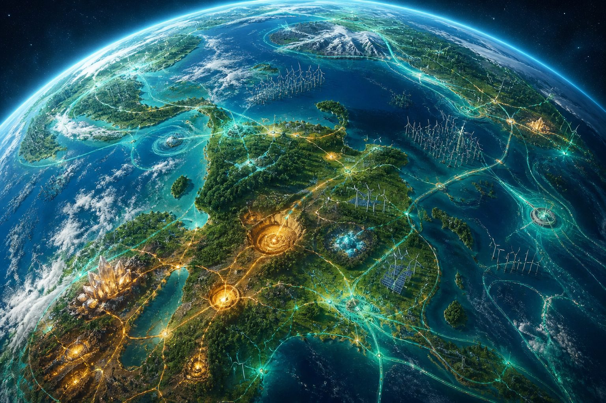
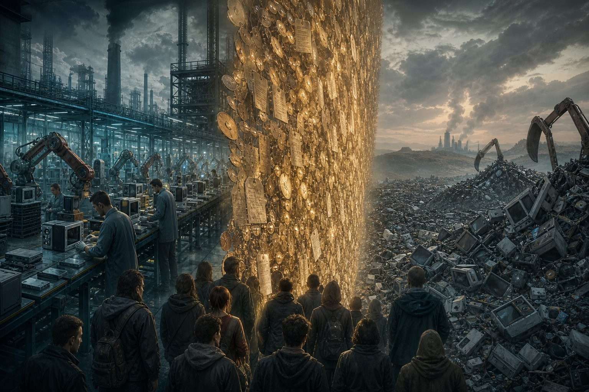
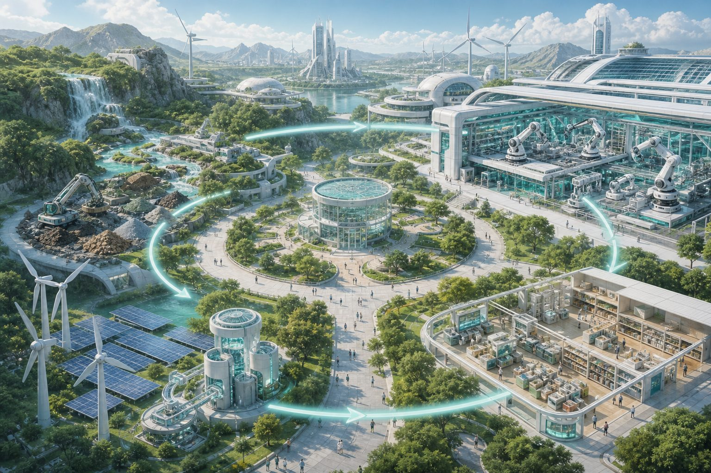
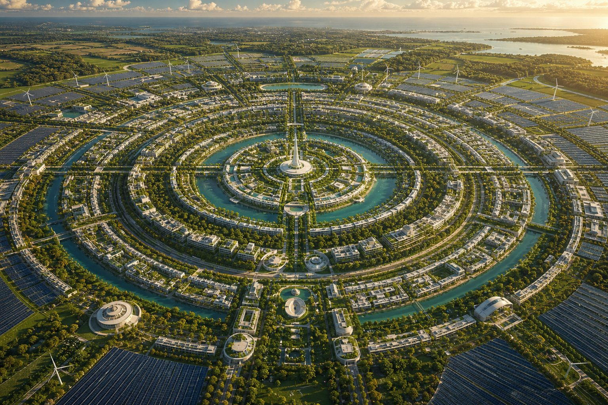
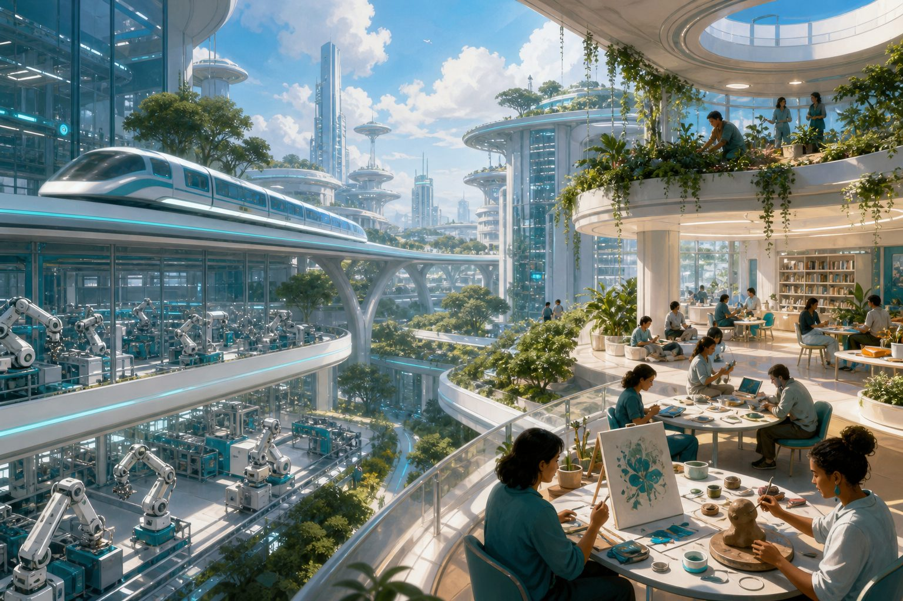

# Реферат: Жак Фреско о дефиците ресурсов, мировой экономике и путях решения

**Тема:** Критика денежной экономики и концепция ресурсо-ориентированной экономики (Resource-Based Economy)  
**Фигура:** Jacque Fresco (1916–2017), основатель The Venus Project  
**Формат:** обзор для широкой аудитории  
**Дата:** 5 августа 2026 г.

---

## Содержание

1. [Введение](#введение)
2. [Кто такой Жак Фреско](#кто-такой-жак-фреско)
3. [Диагноз: в чём, по Фреско, проблема](#диагноз-в-чём-по-фреско-проблема)
4. [Дефицит: природный и искусственный](#дефицит-природный-и-искусственный)
5. [Проблемы мировой экономики](#проблемы-мировой-экономики)
6. [Решение: ресурсо-ориентированная экономика](#решение-ресурсо-ориентированная-экономика)
7. [The Venus Project: города, техника, переход](#the-venus-project-города-техника-переход)
8. [Критика и открытые вопросы](#критика-и-открытые-вопросы)
9. [Заключение](#заключение)
10. [Источники](#источники)

---

## Введение

Жак Фреско утверждал: человечеству не хватает не денег, а **разумного управления ресурсами планеты**. Пока блага распределяются через цены, долг и прибыль, дефицит, бедность и войны воспроизводятся даже там, где технически уже возможны изобилие и устойчивость.

Его ответ — **ресурсо-ориентированная экономика** (*Resource-Based Economy*, RBE): все ресурсы Земли объявляются общим наследием человечества; товары и услуги становятся доступны без денег, кредита и бартера; научный метод и автоматизация заменяют политику как главный инструмент планирования.

*Илл. 1. Образ «общего наследия»: планета связана единой сетью энергии, транспорта и учёта ресурсов.*

---

## Кто такой Жак Фреско

| | |
|---|---|
| **Годы жизни** | 1916–2017 |
| **Страна** | США (родился в Нью-Йорке; поздние годы — Флорида) |
| **Профиль** | промышленный дизайнер, социальный инженер, футуролог, популяризатор |
| **Главный проект** | **The Venus Project** (с 1980-х; исследовательский центр в Венус, Флорида) |
| **Ключевые тексты** | *The Best That Money Can’t Buy*; *Designing the Future*; лекции и фильмы проекта |

Фреско не был академическим экономистом. Его сила — в **системном дизайне**: он соединял инженерию городов, транспорт, энергетику и критику социальных институтов в одну картину «цивилизации, спроектированной как машина жизнеобеспечения». Вместе с Роксаной Медоуз он десятилетиями пропагандировал RBE через макеты, лекции и документальные фильмы (в том числе в сотрудничестве с движением Zeitgeist).

Коротко его кредо:

> Нужны не деньги, а **интеллектуальное управление ресурсами Земли** на благо всех.

---

## Диагноз: в чём, по Фреско, проблема

Фреско начинал не с утопии, а с **диагноза действующей системы**.

### 1. Деньги — посредник, ставший хозяином

Если бы все деньги исчезли за ночь, но остались почва, заводы, люди и знания, общество всё равно могло бы производить еду, жильё и медицину. Значит, людям нужны **ресурсы и доступ**, а не бумажные или цифровые знаки обмена. Денежная система, по Фреско, превращает средства учёта в **цель**, подчиняя производство прибыли, а не нуждам.

### 2. Политика без технической компетенции

Он скептически относился к политикам как главному классу решений: сложные системы (энергия, экология, логистика) требуют **научного метода**, а не идеологической риторики и краткосрочных выборов. Проблема не в «плохих людях у власти», а в **устаревшей архитектуре** стимулов.

### 3. Ценности, заточенные под дефицит

Страх нужды порождает жадность, преступность, национализм и милитаризм. Пока дефицит встроен в правила игры, моральные призывы («будьте добрее») бессильны: система награждает иное поведение.

---

## Дефицит: природный и искусственный

Фреско различал два типа нехватки.

| Тип | Суть | Пример |
|---|---|---|
| **Природный дефицит** | Ресурс объективно ограничен относительно потребности | Пресная вода в пустыне без опреснения и логистики |
| **Искусственный дефицит** | Нехватка создаётся или поддерживается правилами рынка | Плановое устаревание, патенты, уничтожение «излишков», ценовой барьер при наличии складов |

Ключевой тезис: **при нынешнем уровне науки и техники большинство «дефицитов» — искусственные**. Их поддерживают:

- **плановое устаревание** (товары делают хрупкими, чтобы продавать снова);
- **прибыль как фильтр доступа** (нужда без платёжеспособности = «не спрос»);
- **конкуренция вместо кооперации** лабораторий и стран;
- **военные и спекулятивные приоритеты** вместо жизнеобеспечения.

*Илл. 2. Метафора искусственного дефицита: производство и свалка разделены барьером цен и долга.*

Когда численность населения и нагрузка **превышают несущую способность** территории (при плохом управлении), Фреско признавал рост конфликтов. Но выход он видел не в морали «смирись», а в **технологии + переустройстве распределения**: возобновляемая энергия, автоматизация, глобальный учёт запасов, города, спроектированные под эффективность.

---

## Проблемы мировой экономики

С точки зрения Фреско, «кризисы» — не случайные сбои, а **нормальные продукты** денежно-рыночной логики.

### Долг и циклы

Кредитная экспансия, пузыри и обвалы — следствие системы, где рост долга и прибыли важнее устойчивости. Рецессии «лечат» безработицей и сокращением потребления — то есть **наказывают людей** за математику денег.

### Безработица от прогресса

Автоматизация в денежной экономике — угроза: робот вытесняет работника → теряется доход → падает спрос. В RBE та же автоматизация — **освобождение** от вынужденного труда. Проблема не в роботах, а в том, что доступ к благам привязан к зарплате.

### Экология против прибыли

Загрязнение, вырубка, истощение почв выгодны, пока внешние издержки не входят в отчётность. Фреско считал: пока среда — «бесплатный склад», система будет её грабить. Устойчивость требует **проектирования**, а не косметических налогов поверх той же мотивации.

### Войны и геополитика ресурсов

Конкуренция за рынки, нефть, редкоземельные металлы и торговые пути превращает планету в поле нулевой суммы. Объявление ресурсов **общим наследием** снимает саму рамку «чей нефтяной бассейн».

### Образование и стимулы

Школа и СМИ, по Фреско, готовят людей к роли потребителей и наёмных работников, а не системных мыслителей. Новая экономика требует **новой культуры**: мерило успеха — вклад, творчество, понимание систем, а не накопление собственности.

---

## Решение: ресурсо-ориентированная экономика

### Определение

**Ресурсо-ориентированная экономика** — социально-экономическая система, в которой:

1. все планетарные ресурсы объявлены **общим наследием** жителей Земли;
2. товары и услуги доступны **без денег, кредитов, бартера и долговой зависимости**;
3. производство и распределение ведутся на основе **научной оценки потребностей, запасов и экологических пределов**;
4. автоматизация и возобновляемая энергия обеспечивают высокий уровень жизни **для всех**, а не для платёжеспособного меньшинства.

*Илл. 3. RBE как единый контур: ресурсы → энергия → автоматизация → открытый доступ.*

### Три опоры

| Опора | Содержание |
|---|---|
| **Экологическая** | Учёт несущих способностей экосистем; минимизация отходов; замкнутые циклы |
| **Технологическая** | Кибернетический мониторинг запасов; автоматизация производства и логистики; возобновляемая энергия |
| **Человеческая** | Новые стимулы: самореализация, творчество, забота о среде вместо накопления власти и богатства |

### Что меняется по сравнению с рынком

- **Не «распределять деньги», а распределять доступ** к результатам производства.
- **Не конкурировать патентами**, а открыто делиться знаниями.
- **Не удерживать рабочие места ради зарплаты**, а автоматизировать опасный и рутинный труд.
- **Не голосовать идеологиями о технических системах**, а проектировать их как инженеры проектируют мост: по данным и безопасности.

Фреско подчёркивал: RBE — **не коммунизм XX века** (не диктатура партии, не уравниловка дефицита) и **не «свободный рынок без денег»**. Это попытка перенести логику **системной инженерии** на цивилизацию целиком.

---

## The Venus Project: города, техника, переход

### Круглые города

Визитная карточка проекта — **концентрические города**: кольца жилья, парков, исследований, производства и транспорта вокруг центра. Такая форма сокращает пути, упрощает инженерные сети и встраивает зелёные пояса в ткань города. Вокруг — агрокультуры, опреснение, массивы солнечной и ветровой энергии.

*Илл. 4. Концентрический город: плотность, зелёные кольца и возобновляемая энергия на периферии.*

### Автоматизация и «изобилие»

В модели Фреско заводы, склады и транспорт всё больше работают без человеческого принуждения. Люди смещаются к науке, искусству, воспитанию, исследованию — туда, где машина пока слабее. Изобилие здесь значит не бесконечное потребление, а **снятие страха нужды** при разумных пределах среды.

*Илл. 5. Автоматизированное производство рядом с пространствами обучения, творчества и совместной жизни.*

### Как мыслился переход

Фреско не предлагал «переключить рубильник за одну ночь». В его риторике переход включал:

1. **глобальную инвентаризацию** ресурсов и потребностей («что у нас есть?»);
2. **совместные энергетические программы** без патентных барьеров;
3. **демонстрационные города** и исследовательские центры как доказательство концепции;
4. **перестройку образования** под системное мышление;
5. постепенный **выход из денежной логики** по мере роста автоматического изобилия.

Практически Venus Project остался на уровне центра во Флориде, макетов, публикаций и пропаганды. Это важно для честной оценки: речь о **проекте-программе**, а не о реализованной стране.

---

## Критика и открытые вопросы

Реферат был бы неполным без возражений, которые обычно выдвигают экономисты, политологи и инженеры.

| Вопрос | Суть критики |
|---|---|
| **Кто решает?** | Даже «научное» планирование — человеческий институт: кто задаёт цели, веса, приоритеты? Риск технократии. |
| **Стимулы** | Без цены и прибыли как сигналов: как выявлять предпочтения, инновации, редкость во времени? |
| **Политическая реализуемость** | Национальные государства, корпорации и армии вряд ли добровольно сдадут контроль над ресурсами. |
| **Масштаб данных** | Глобальный учёт в реальном времени огромен; ошибки модели могут быть системными. |
| **Культура** | Переход требует смены ценностей; одних чертежей городов недостаточно. |
| **Исторический опыт** | Плановые экономики XX века часто давали дефицит и бюрократию — критики спрашивают, чем RBE гарантированно отличается на практике. |

Сторонники Фреско отвечают: отличие — в **уровне автоматизации**, открытости знаний и отказе от политической касты в пользу инженерии жизнеобеспечения. Скептики отвечают: это пока **обещание**, а не доказанный механизм.

Для читателя полезно держать обе стороны: идеи Фреско сильны как **критика искусственного дефицита и устаревших стимулов**; слабее — как готовый операционный план для 8 миллиардов человек.

---

## Заключение

Жак Фреско сводил кризис мировой экономики к простому ядру:

1. **Ресурсов на планете достаточно**, чтобы обеспечить высокий уровень жизни при научном управлении.
2. **Денежная рационировка** делает дефицит хроническим, даже когда склады полны.
3. **Автоматизация + возобновляемая энергия + общее наследие ресурсов** — путь к экономике доступа без долга.
4. **Города и инфраструктура** должны проектироваться как единая система жизнеобеспечения (Venus Project).
5. Главное препятствие — не «нехватка железа», а **устаревшие ценности и институты**, заточенные под прибыль и страх нужды.

Его наследие — не готовый закон экономики, а **рамка вопроса**: если цель — здоровье людей и планеты, почему мы всё ещё оптимизируем деньги, а не ресурсы?

---

## Краткая шпаргалка

| Понятие | Простыми словами |
|---|---|
| **Искусственный дефицит** | Нехватка, созданная правилами рынка, а не природой |
| **RBE** | Экономика доступа к ресурсам без денег и долга |
| **Общее наследие** | Ресурсы планеты принадлежат всем жителям, не элите |
| **Venus Project** | Проект городов и инфраструктуры под RBE |
| **Плановое устаревание** | Намеренно короткий срок жизни товаров ради повторных продаж |
| **Кибернетическое управление** | Учёт и распределение по данным, а не по цене |

---

## Источники

1. The Venus Project — *What is a Resource-Based Economy?* (thevenusproject.com)
2. Jacque Fresco — *Designing the Future* (электронная публикация Venus Project)
3. Jacque Fresco — *The Best That Money Can’t Buy*
4. The Venus Project — материалы о Resource-Based Economy и истории термина
5. Документальные и лекционные материалы Venus Project / смежные популяризации (в т.ч. цикл Zeitgeist)

*Реферат излагает позиции Фреско и Venus Project в доступной форме; это обзор идей, а не агитация и не академическая экспертиза всех альтернативных экономических теорий.*
