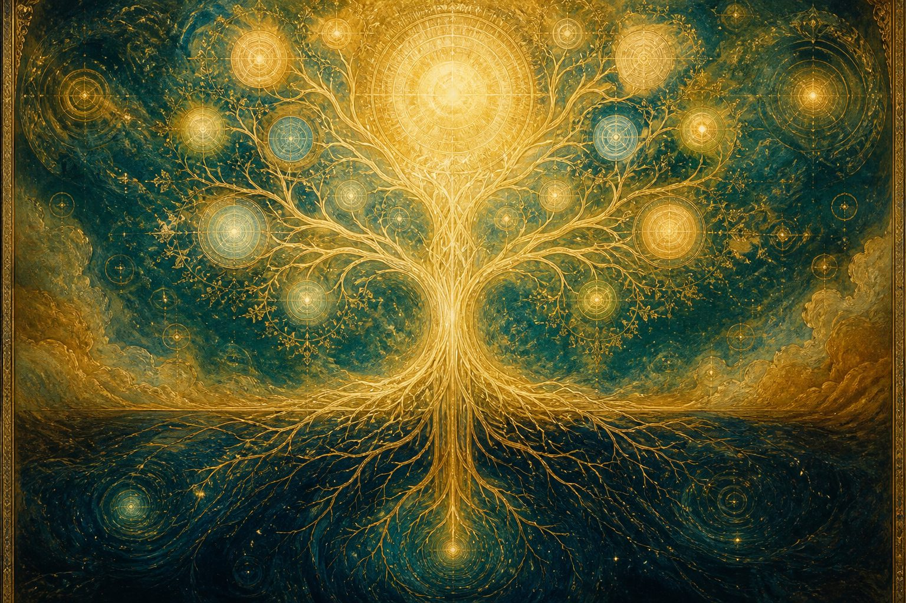
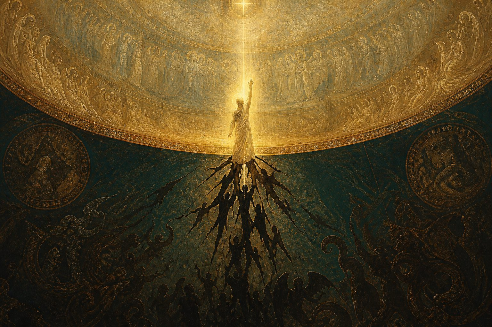
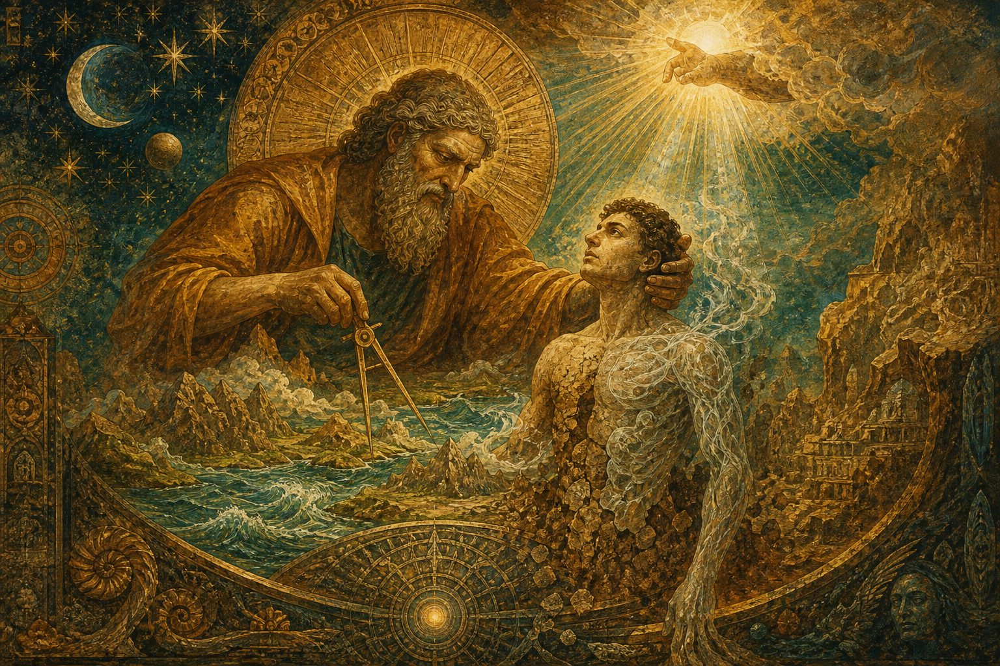
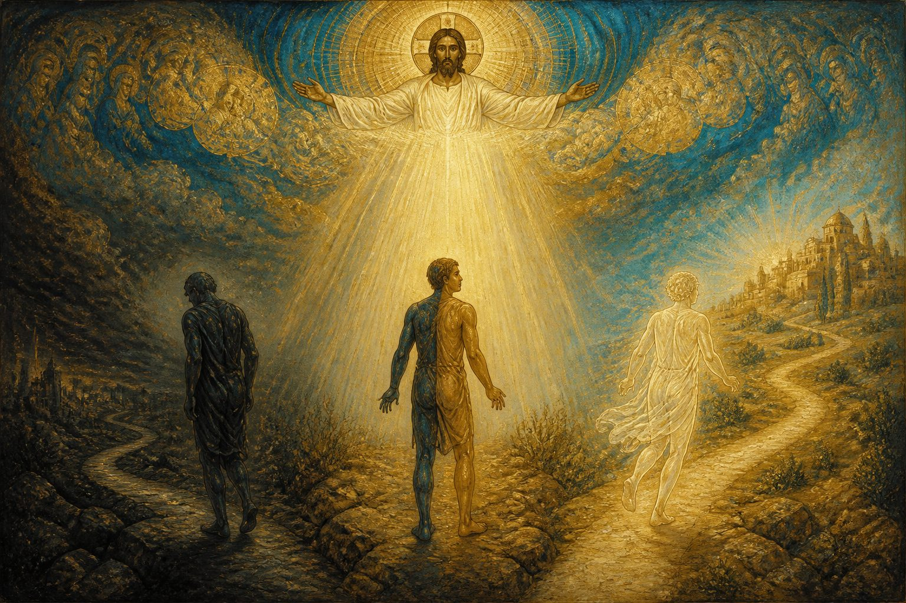
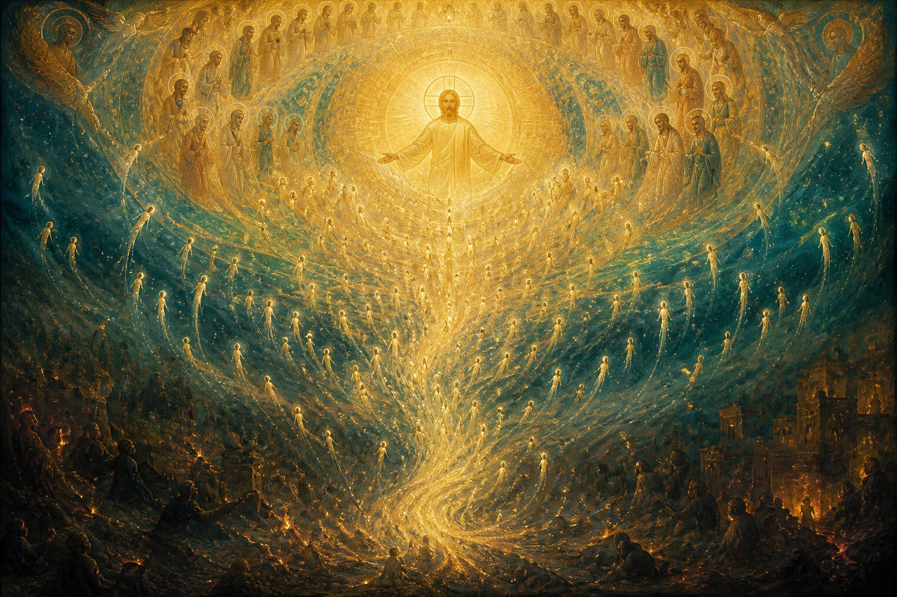

# Трёхчастный трактат: реферат

**Источники:** Nag Hammadi Codex I,5 (Jung Codex); перевод H. W. Attridge & D. Mueller; комментарии E. Thomassen, B. A. Pearson, A. И. Еланской.

---

## О чём этот текст одной фразой

Это самый полный дошедший до нас **систематический** валентинианский трактат: от непостижимого Отца и полноты божественного мира — через «сбой» Логоса и рождение материального космоса — к приходу Спасителя и окончательному возвращению всего духовного в единство.



*Илл. 1. Отец — корень Totality; из него прорастают эоны Плеромы.*

---

## 1. Что это за памятник

| | |
|---|---|
| **Где найден** | Библиотека Наг-Хаммади (Египет, 1945), кодекс I |
| **Объём** | ~88 страниц рукописи (второй по длине текст собрания) |
| **Язык рукописи** | Коптский; оригинал, скорее всего, греческий |
| **Датировка** | Обычно II пол. III в. (с опорой на более ранние валентинианские идеи) |
| **Автор** | Неизвестен; школа **валентиниан** |
| **Название** | В рукописи заголовка нет. Издатели назвали текст *Tractatus Tripartitus*, потому что переписчик дважды разделил его декоративными знаками на **три части** |

Для истории гностицизма трактат особенно ценен: это не отрывок мифа и не полемический пересказ церковных отцов, а **целостная система** «изнутри» традиции — причём в версии, заметно отличающейся от схем, которые описывали Ириней и Ипполит.

---

## 2. Картина мира в трёх актах

Логика текста — как у большой драмы:

1. **Происхождение** — кто такой Отец, как из него рождаются Сын, Церковь и эоны; как младший эон (Логос) выходит за предел и порождает ущербный мир.
2. **Человек** — как Демиург и силы «справа / слева» лепят первого человека; почему люди бывают трёх родов.
3. **Спасение** — приход Спасителя, разные ответы трёх родов, искупление и *апокатастасис* (восстановление).

Ниже — содержание по частям простым языком.

---

## Часть I. Отец, Плерома и «движение» Логоса

### Отец

Трактат начинается не с космоса, а с **истока**. Отец:

- единственный в собственном смысле слова;
- нерождённый, без начала и конца;
- неизменный, непостижимый, несказанный;
- богат дарами и «в покое» при их раздаче;
- подобен **корню**, из которого растут дерево, ветви и плоды.

Ни одно имя не исчерпывает Его. Имена мы произносим «по мере нашей способности» — как славу, а не как определение. Сам Он знает Себя; если Он желает быть познанным, это Его воля и сила.

### Сын и Церковь

Из Отца «издревле» существуют:

- **Сын** — первородный и единственный; форма безформенного, слово несказанного, ум непостижимого; через Него Totality узнаёт, что Отец есть;
- **Церковь** — не земная община, а изначальное множество «святых нетленных духов», «эоны эонов», существующее как сущность Сына.

Это ближе к своего рода **троице** (Отец — Сын — Церковь), чем к классической валентинианской огдоаде из мужских и женских пар. Первоначало здесь **монадно**: один Отец, без изначальной мужско-женской диады.

### Эоны: как рождается Полнота

Эоны сначала существуют в мысли Отца, словно **зародыши в утробе**. Отец хочет, чтобы они не только были «для Него», но и **для самих себя** — и постепенно даёт им форму, имя «Отец» и способность искать Того, кого ещё не видят.

Почему Он не открывается сразу? Не из зависти: внезапное явление Его величия уничтожило бы их. Познание даётся как **школа**: вера, надежда, любовь, понимание, мудрость — «корневые импульсы» на пути к Нему.

Эманация описана не как арифметика (30 имён, как у Иринея), а **эмбриологически**: постепенное «рождение» бесчисленных и безымянных эонов. Их прославление Отца порождает новые «плоды» славы — жизнь Плеромы как гармоничного хора.

### Логос: не злая «София», а благое, но невозможное желание

Здесь главный сюжетный поворот — и важное отличие от других валентинианских систем.

Павший эон **не называется Софией**. Это **Логос** (Слово) — младший из эонов. Его намерение **благое**: он хочет постичь непостижимое и прославить Отца ещё совершеннее. Но он действует:

- не из согласия всей Полноты;
- без «команды» сверху;
- выходя за положенный предел речи о Отце.

Результат: он не выдерживает света, смотрит «в глубину», **сомневается в себе**, делится. Из самовозвышения и сомнения рождаются:

- тени, копии, фантазмы;
- силы **жажды власти**, вражды, непослушания;
- мир «подобия» — красивый, как отражение, но пустой по сути.

Текст прямо говорит: движение Логоса **нельзя просто осуждать** — оно стало причиной той «организации» мира, которая была предназначена. Дефект вписан в промысел.



*Илл. 2. Логос устремляется к непостижимому; внизу рождаются тени и силы раздора.*

### Обращение, Спаситель Плеромы, Демиург

Логос видит вместо совершенства — ущерб, вместо единства — раскол. Он **обращается** (*metanoia*): молится Полноте, вспоминает братьев и прежде всего Отца. Из молитвы рождаются лучшие силы — «существа мысли», предрасположенные искать Пресущее.

Эоны в согласии порождают **плод** — Возлюбленного Сына, именуемого также Спасителем, Христом, Светом. Он:

- совершенствует ущербного;
- утверждает совершенных;
- молнией является низшим силам (они падают во тьму/хаос/Аид), а «правым» даёт надежду.

Логос устраивает космос по чинам:

| Порядок | Имена в тексте | Характер |
|---|---|---|
| Образы / духовное | образы Плеромы, «Церковь» Логоса | чистота, радость, подобие Полноте |
| **Правые** | psychic, «огненные», «средние» | мысль, закон, надежда, возможность обращения |
| **Левые** | hylic, «тёмные», «последние» | подобие, зависть, жажда власти, хаос |

Над архонтами поставлен **Архонт без начальника над собой** — Демиург. Он — «лицо», которое Логос породил как **изображение** Отца Totality. Его зовут отец, бог, творец, царь, судья, закон.

Ключевой момент: Демиург **действительно** творит прекрасное и радуется, думая, что всё — от него. Но движет им невидимый дух Логоса. Он — **рука и уста** высшего замысла, сам того не зная.

---

## Часть II. Сотворение человека



*Илл. 3. Демиург ваяет мир; свыше его ведёт свет, которого он не узнаёт.*

Человек создан **в конце**, когда «сцена» уже готова — как тот, ради кого устроено воспитание.

Он — **смесь**:

- тень земного, отрезанного от Totality;
- вклад сил «справа» и «слева»;
- **живая душа** от духовного Логоса (а творец думает, что вдохнул её сам);
- плюс «свои» люди от Демиурга и от левых сил.

Три субстанции:

1. **Духовная** — едина;
2. **Душевная (psychic)** — двояка (может к добру и к исповеданию Высшего);
3. **Материальная** — многообразна и слаба во многих наклонениях.

Рай — сад «тройного порядка». Запрет, змей и изгнание трактуются не как простая катастрофа, а как **промысел**: человек должен кратко пережить великое зло — смерть и незнание Totality, — чтобы затем принять величайшее благо — вечную жизнь и твёрдое знание. Смерть «царит» по воле Отца в рамках этой организации.

---

## Часть III. Спаситель, три рода людей, восстановление

### Почему люди спорят о мире

Сначала трактат объясняет пестроту философий и религий: правые и левые силы подражают друг другу, мудрецы «эллинов и варваров» хватают лишь воображаемые силы и порождают противоречивые теории. У евреев пророки говорили не от фантазии, а силой, действовавшей в них, — но слушатели по-разному истолковали Писание, и возникли «многие ереси».

Пророки предчувствовали приход Спасителя, но не знали, откуда Он и какова Его вечная природа.

### Воплощение

Спаситель принимает **смерть** тех, кого спасает, и их «малость» — зачатие, младенчество, тело и душу. Он без греха и пятна; Он — образ Единого, Totality в телесной форме, поэтому сохраняет неделимость и бесстрастие в глубине, хотя реально воплощён.

Это ещё одно отличие от схем церковных ересеологов: здесь нет отдельного «душевного Христа», который страдает, пока истинный Спаситель остаётся невредимым. **Сам Спаситель** воплощается, страдает, умирает и нуждается в искуплении как человек Церкви — чтобы дать искупление остальным.

Искупление = выход из рабства незнания + принятие свободы, которая есть **знание истины**, бывшей прежде незнания.

### Три рода человечества



*Илл. 4. Три ответа на явление Света: отвращение, колебание, мгновенное узнавание.*

Приход Спасителя **проявляет**, кем кто был:

| Род | Образ | Реакция на Спасителя | Итог |
|---|---|---|---|
| **Духовный** (pneumatic) | свет от света | сразу бежит к Нему, становится «телом своей Главы» | полное спасение |
| **Душевный** (psychic) | свет от огня | медлит; учится голосом, верой и обетованием | возможен исход к добру |
| **Материальный** (hylic) | тьма | чужд свету, ненавидит явление, которое его разрушает | разрушение |

«Избрание» близко Спасителю как брачный чертог; «призвание» (правые) радуется браку извне и имеет место в эоне образов. Даже некоторые из «смешанных» и жаждущих власти могут получить награду, если оставят тщеславие и соблюдут заповедь Господа славы.

### Конец как начало: апокатастасис



*Илл. 5. Рассеянные искры восходят; конец снова становится единством.*

Цель истории — не вечная битва, а **восстановление** (*apokatastasis*):

- конец подобен началу — **единству**;
- нет уже «мужа и жены, раба и свободного, обрезания и необрезания, ангела и человека» — но Христос — всё во всём;
- искупление нужно не только людям, но ангелам, образам и самим плеромам эонов;
- крещение в полном смысле — искупление в Отца, Сына и Духа; его имена: одеяние, утверждение истины, тишина, брачный чертог, незаходящий свет, вечная жизнь.

Незнание и боль были **педагогикой**: Totality должна устать искать Отца своими силами, чтобы принять знание как дар Его сладости. Материальные силы полезны «на время организации», но в конце возвращаются в небытие, из которого пришли.

Трактат завершается славословием любви Спасителя — Искупителя всех, принадлежащих Тому, кто исполнен Любви.

---

## 3. Чем эта система особенна

1. **Монадный Отец** вместо первичной пары.
2. **Сын и Церковь** как изначальные спутники Отца (вместо сложной огдоады имён).
3. **Эоны безымянны и неисчислимы**; эманация — как беременность и рождение, не как геометрия чисел.
4. Падший эон — **Логос**, не София; его мотив благ.
5. **Нет** отдельного «душевного Христа»: Спаситель сам воплощён и страдает.
6. Сильный акцент на **промысле, воспитании, икономии**: дефект, космос и даже смерть служат конечному знанию.
7. Близость к некоторым мотивам **Оригена** (вечное рождение Сына, конец как единство, педагогика спасения) при сохранении валентинианского каркаса.
8. Этика звучит **детерминистски**: природа рода проявляется в ответе на Спасителя; при этом «правым» и даже некоторым честолюбивым открыт путь смирения и награды.

---

## 4. Суть трактата — если совсем просто

Представьте три этажа одной истории.

**Наверху** — тихий, непостижимый Отец. Из Него, как из корня, растёт живая Полнота: Сын, Церковь, множество эонов, которые учатся любить и искать То, что больше их.

**В середине** — младший эон слишком сильно захотел объять Бесконечное. Из этого благого, но невозможного желания родились тени, власть, хаос и мастер-творец, который думает, что он бог. Так появился наш мир — не случайно и не «назло», а как школа.

**Внизу** — человек как смесь света и глины. Когда приходит Спаситель, смесь расслаивается: кто-то узнаёт Свет сразу, кто-то учится верить, кто-то отворачивается. История кончается не победой тьмы, а тем, что всё, что от света, возвращается в единство, а пустые подобия гаснут.

**Главная мысль трактата:** незнание и разрыв — не последнее слово. Они входят в замысел Отца, чтобы любовь и знание стали не навязанной данностью, а прожитым возвращением домой.

---

## Краткая схема

```
Отец (непостижимый корень)
  └─ Сын + Церковь
       └─ Эоны Плеромы
            └─ Логос (выход за предел → ущерб)
                 ├─ обращение / молитва
                 ├─ плод согласия = Спаситель
                 ├─ чины: образы | правые | левые
                 └─ Демиург → космос → смешанный человек
                                      └─ явление Спасителя
                                           ├─ духовные → сразу к Нему
                                           ├─ душевные → через веру/учение
                                           └─ материальные → отвержение
                                      └─ апокатастасис: конец = единство начала
```

---

## Для дальнейшего чтения

- Англ. перевод: H. W. Attridge & D. Mueller в *The Nag Hammadi Library in English* (J. M. Robinson).
- Введение: E. Thomassen в *The Nag Hammadi Scriptures* (M. Meyer).
- Рус. перевод и комм.: А. И. Еланская, *Трехчастный трактат*.
- Контекст: B. A. Pearson, *Ancient Gnosticism*; P. Linjamaa, *The Ethics of The Tripartite Tractate*.
