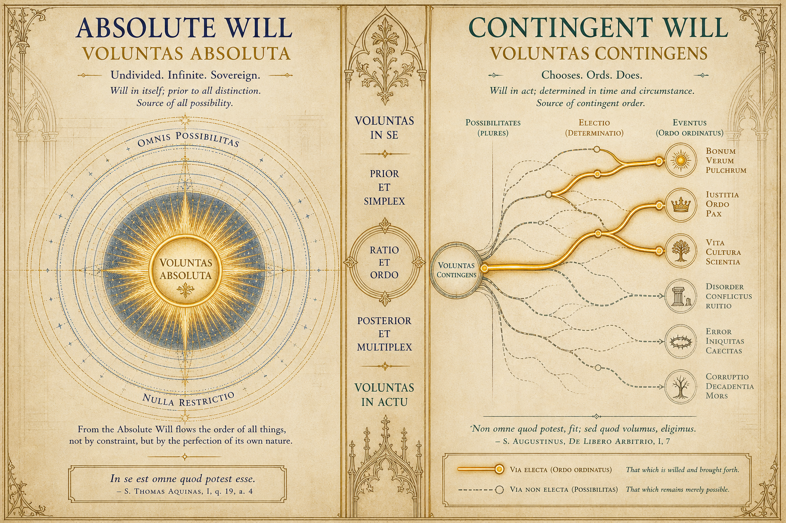
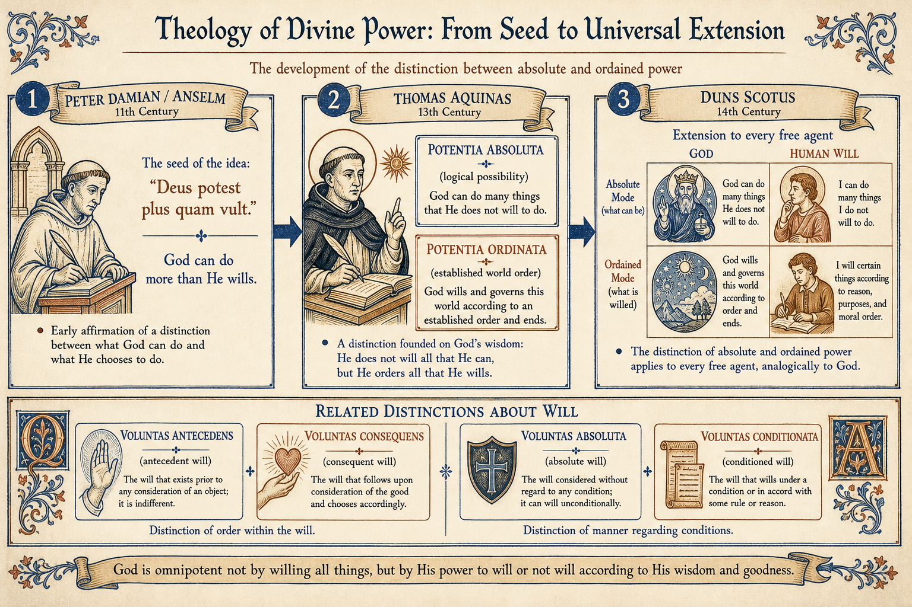
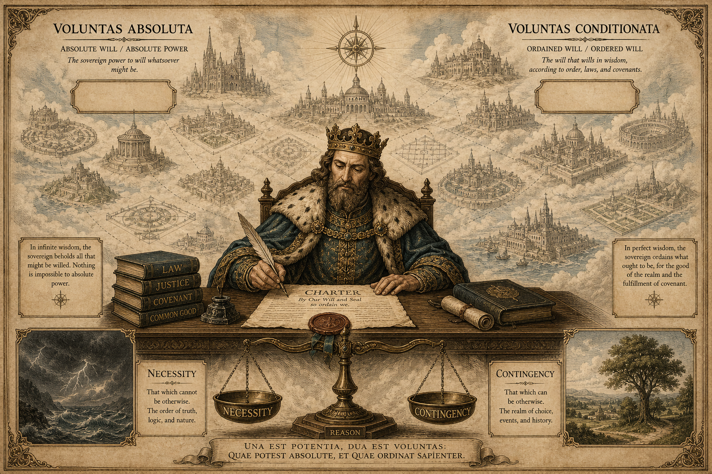
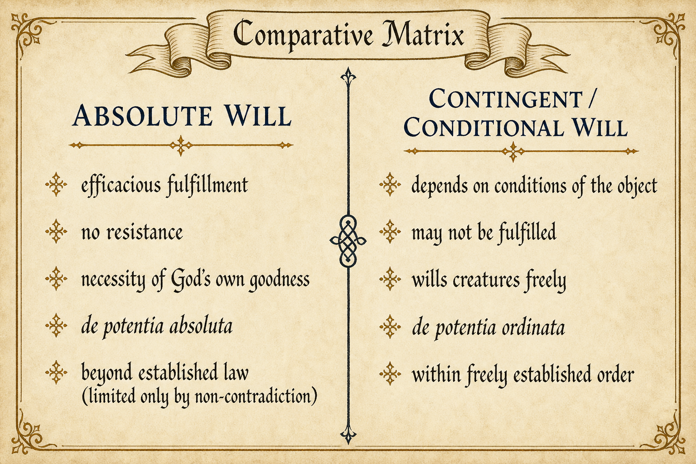
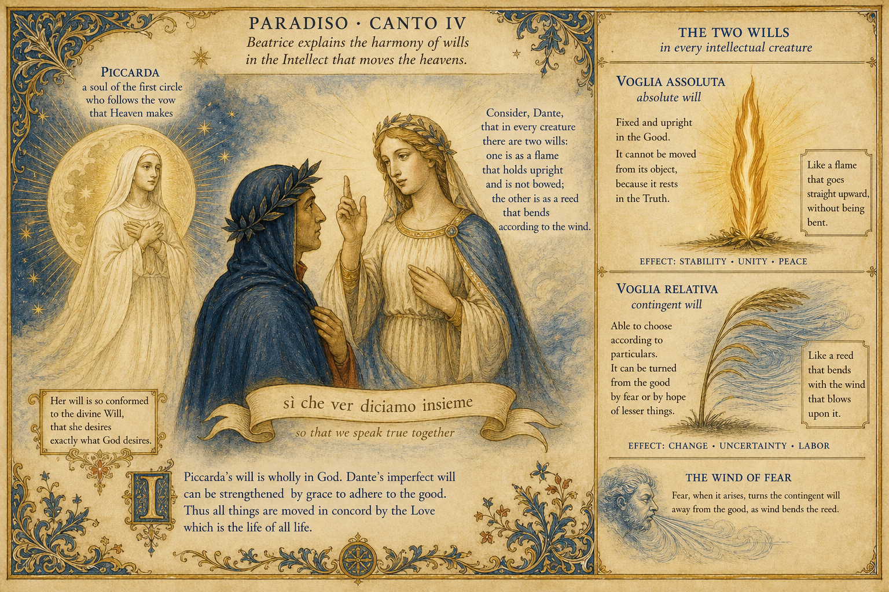
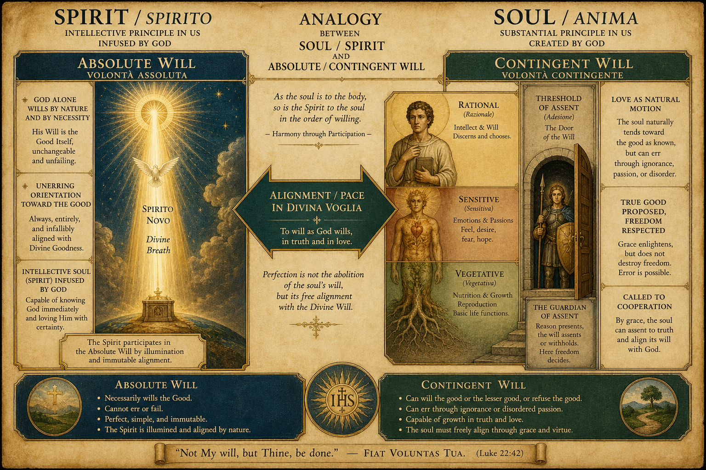

# Абсолютная и контингентная воля  
## (Absolute Will & Contingent Will)

**Реферат по истории философии и философской теологии**

---

### Содержание

1. [Введение и постановка проблемы](#1-введение-и-постановка-проблемы)
2. [Ключевые термины](#2-ключевые-термины)
3. [Историческое развитие различения](#3-историческое-развитие-различения)
4. [Абсолютная воля](#4-абсолютная-воля)
5. [Контингентная (условная) воля](#5-контингентная-условная-воля)
6. [Сравнительный анализ](#6-сравнительный-анализ)
7. [Данте: absolute / contingent will в «Божественной комедии»](#7-данте-absolute--contingent-will-в-божественной-комедии)
8. [Аналогии с душой (soul) и духом (spirit)](#8-аналогии-с-душой-soul-и-духом-spirit)
9. [Антропологический и этический смысл](#9-антропологический-и-этический-смысл)
10. [Выводы](#10-выводы)
11. [Источники](#11-источники)

---

## 1. Введение и постановка проблемы

Пара понятий **absolute will** (*voluntas absoluta*) и **contingent will** (*voluntas contingens / conditionata*) принадлежит к ядру средневековой схоластики и поздней философской теологии. Через них мыслители пытались ответить на два взаимосвязанных вопроса:

1. **Как совместить всемогущество и свободу Бога** с устойчивостью миропорядка, морали и обетований?
2. **Как сохранить контингентность (не-необходимость) тварного мира** — то есть возможность того, что вещи могли бы быть иначе, — не разрушая при этом идею действенного божественного промысла?

Если воля Бога мыслится как абсолютно необходимая во всём, мир оказывается жёстко детерминирован, а свобода твари — фикцией. Если же воля Бога мыслится как полностью произвольная и ничем не связанная, рушится доверие к установленному порядку спасения и нравственному закону. Различение абсолютной и контингентной (а также «упорядоченной») воли/мощи стало инструментом для удержания обеих интуиций.

> **Рабочая формула:**  
> *Абсолютная воля* обозначает суверенную способность хотеть и осуществлять то, что не противоречит логике;  
> *контингентная воля* обозначает свободное, не необходимое хотение конкретных тварных состояний дел — часто под условием, связанным с объектом хотения.



*Илл. 1. Два режима воли: неделимая суверенность (слева) и ветвящееся поле возможностей (справа).*

---

## 2. Ключевые термины

| Латинский термин | Русский эквивалент | Краткий смысл |
|---|---|---|
| *voluntas absoluta* | абсолютная воля | действенное, безусловное хотение; у Бога — то, что непременно исполняется |
| *voluntas conditionata / contingens* | условная / контингентная воля | хотение, зависящее от условий объекта или от свободного выбора среди альтернатив |
| *voluntas antecedens* | предшествующая воля | воля «по природе вещи» (напр.: «Бог хочет спасения всех людей») |
| *voluntas consequens* | последующая воля | воля с учётом всех обстоятельств лица (напр.: конкретный исход спасения/осуждения) |
| *potentia absoluta* | абсолютное могущество | способность сделать всё логически возможное |
| *potentia ordinata* | упорядоченное могущество | способность действовать в рамках свободно установленного Богом порядка |
| *necessitas absoluta* | абсолютная необходимость | то, что не может быть иначе |
| *necessitas ex suppositione* | гипотетическая необходимость | необходимость «при допущении» (если Бог захотел X, то X будет) |

Важно: в схоластике эти пары **не всегда тождественны**, но часто **пересекаются**. Так, *voluntas absoluta* сближают с *voluntas beneplaciti* (волей благоволения) и *voluntas consequens*, а *voluntas conditionata* — с *voluntas signi* (волей знака/закона) и *voluntas antecedens*.

---

## 3. Историческое развитие различения



*Илл. 2. От Петра Дамиани и Ансельма — к Фоме Аквинскому и Дунсу Скоту.*

### 3.1. Предыстория (XI–XII вв.)

- **Пётр Дамиани** (*De divina omnipotentia*): из того, что Бог *не делает* чего-то, не следует, что Он *не может* этого сделать. Тем самым отделяется сфера «возможного для Бога» от сферы «реально желаемого и осуществлённого».
- **Ансельм Кентерберийский**: уточняет, что «неможет» Бога (обманывать, грешить) часто означает не слабость, а совершенство; одновременно в поздних текстах появляется идея *самоограничения* волей.
- **Пётр Ломбардский** (*Sententiae* I, dd. 42–44): закрепляет тезис «Бог может многое из того, чего не желает» — учебная точка отсчёта для XIII века.

### 3.2. Классическая схоластика (XIII в.)

- **Александр Гэльский**, **Альберт Великий**, затем **Фома Аквинский** терминологически закрепляют пару *potentia absoluta / ordinata*.
- У Фомы (*Summa Theologiae* I, q. 19; q. 25):
  - Бог **необходимо** хочет Своей благости;
  - твари Он хочет **не абсолютно необходимо**, а свободно (контингентно);
  - при этом, *предположив* что Он чего-то захотел, это желание уже «необходимо по гипотезе» (*necessitas ex suppositione*), но само творение остаётся контингентным.
  - Действенность божественной воли такова, что вещи происходят **не только как** Он хочет, но и **тем способом** (необходимо или контингентно), каким Он хочет.

### 3.3. Дунс Скот и операционализация различения

**Иоанн Дунс Скот** (*Ordinatio* I, d. 44) делает принципиальный шаг: различение абсолютного и упорядоченного могущества применимо **не только к Богу**, но к **любому свободному разумному агенту**, который может действовать сообразно праву, но не связан им необходимо.

- *Potentia ordinata* — действие внутри установленного закона/порядка.
- *Potentia absoluta* — способность действовать иначе, чем предписано данным порядком (для Бога — установить иной порядок; предел — закон непротиворечия).

Так контингентность мира получает онтологическое обоснование: альтернативы остаются **реальными синхронными возможностями**, а не только «прошлым, уже закрытым полем выбора».

### 3.4. Поздняя схоластика (Оккам и via moderna)

У **Уильяма Оккама** *absoluta* и *ordinata* — не две силы, а **два способа говорить** об одном могуществе. Акцент смещается на то, что Бог *de potentia absoluta* может произвести эффект без вторичных причин (напр., оправдать без тварного *habitus* благодати). Радикальные выводы оккамистов вызвали опасения «нового пелагианства» и контрреакцию (Григорий из Римини и др.).

---

## 4. Абсолютная воля

### 4.1. Определение

**Абсолютная воля** — это воля, рассматриваемая:

1. **как суверенная и действенная** — то, чего она хочет «просто» (*simpliciter*), исполняется;
2. **как не обусловленная извне** — у Бога нет внешнего принуждения;
3. **в теологическом регистре** — часто как *voluntas beneplaciti*: «воля благоволения», которой никто не может сопротивляться.

### 4.2. Что она «абсолютно» хочет

По Фоме Аквинскому:

- **Необходимый объект** божественной воли — собственная благость Бога.
- Всё тварное — **не необходимый** объект: Бог мог не творить или творить иначе.
- Следовательно, «абсолютность» воли Бога — это абсолютность *субъекта* воления (Его совершенства и действенности), а не абсолютная необходимость *всех* её объектов.

### 4.3. Связь с *potentia absoluta*

Абсолютная воля «смотрит» на поле логически возможных миров. Она указывает: установленный порядок **контингентен**, ибо мог быть другим. Но из этого **не следует**, что Бог хаотически «ломает» собственный закон в каждый момент: операционализация *potentia absoluta* как повседневного произвола — уже поздняя и спорная интерпретация.



*Илл. 3. Классическая аналогия: государь, скрепивший хартию закона (упорядоченная воля), при этом сохраняет суверенную власть установить иной порядок (абсолютная воля/мощь).*

---

## 5. Контингентная (условная) воля

### 5.1. Два смысла «контингентности»

В источниках слово *contingens* и соседнее *conditionata* покрывают **разные, но связанные** идеи:

**A. Метафизическая контингентность воления**  
Воля свободна относительно противоположностей: в тех же обстоятельствах агент мог хотеть иначе (*potuit velle oppositum*). У Скота воля — сила, *не* детерминированная природой к одному акту (в отличие от «природы», которая действует необходимо, если не встретила препятствия).

**B. Условность (*voluntas conditionata*)**  
Хотение формулируется под условием, лежащим **на стороне объекта**, а не как дефект волящего. Классический пример схоластов: «Бог хочет, чтобы все спаслись» — если понимать это как условную/предшествующую волю, условие связано с расположением человека, а не с «несовершенством» Бога.

### 5.2. Antecedens / consequens как рабочая модель

По Дамаскину (и в рецепции Фомы):

- **Antecedens**: рассматривая человека *по природе*, Бог хочет спасения всех.
- **Consequens**: рассматривая лицо *со всеми обстоятельствами* (согласие/сопротивление благодати и т.д.), воля имеет конкретный исход.

Возражение «условная воля несовершенна» схоласты снимают так: условие — *ex parte voliti* (со стороны желаемого), а не *ex parte volentis* (со стороны Волящего).

### 5.3. Контингентные следствия без утраты промысла

Фома настаивает: божественная воля **не уничтожает** контингентность вещей. Напротив, именно потому что воля действенна, она может хотеть, чтобы некоторые эффекты происходили **контингентно** — через контингентные вторичные причины. Необходимость «если Бог хочет X, то X будет» — это необходимость условного высказывания, а не абсолютная необходимость самого X.

---

## 6. Сравнительный анализ



*Илл. 4. Сводная матрица признаков абсолютной и контингентной/условной воли.*

| Критерий | Absolute will | Contingent / conditional will |
|---|---|---|
| Отношение к исполнению | Как правило, **исполняется** (особенно *beneplaciti*) | Может **не исполняться** (особенно *antecedens / signi*) |
| Объект у Бога | Собственная благость — необходимо; твари — свободно | Конкретные тварные исходы, часто с условиями |
| Связь с законом | Может мыслиться *вне* данного порядка (*absoluta*) | Действует *внутри* установленного порядка (*ordinata*) |
| Риск крайности | Волюнтаризм, непредсказуемый Бог | Детерминизм / ослабление суверенитета |
| Антропологический аналог | Способность хотеть иначе, чем «так принято» | Выбор внутри нормы, ролей, обещаний, характера |

### 6.1. Что различение защищает

1. **Свободу Бога** — творение не вынуждено из Его сущности как геометрическая теорема.
2. **Надёжность порядка** — завет, нравственный закон, сакраментальный строй остаются верными *de potentia ordinata*.
3. **Контингентность мира** — «могло быть иначе» сохраняет смысл.
4. **Ответственность твари** — предшествующая воля ко благу всех не отменяет моральной вменяемости.

### 6.2. Где возникают напряжения

- Если *potentia absoluta* гиперболизировать, моральный закон кажется «отзывным в любой миг».
- Если абсолютность воли свести только к необходимости, страдает свобода и чудо.
- Если смешать *conditionata* с психологической нерешительностью, Богу приписывают несовершенство — против чего схоласты специально возражали.

---

## 7. Данте: absolute / contingent will в «Божественной комедии»

У Данте различение абсолютной и контингентной (у него чаще — *относительной / обусловленной*) воли получает **поэтико-этическую драматургию**. Ключевой локус — **Рай, песнь IV** (небо Луны), где Беатриче разрешает кажущееся противоречие между речами Пиккарды Донати и собственным судом о нарушенных обетах.



*Илл. 5. Сцена «Рай» IV: Пиккарда, Беатриче и различение voglia assoluta / voglia relativa.*

### 7.1. Сюжетный узел: Пиккарда и Констанца

В первом небе Данте встречает души монахинь, насильно вырванных из монастыря (**Пиккарда**, **Констанца Сицилийская**). Они пребывают в «низшем» явлении блаженства — не потому, что изгнаны из Эмпирея (все блаженные живут в Эмпирее), а чтобы **показать степень** их заслуги.

Пиккарда утверждает: Констанца *в сердце* никогда не отрекалась от покрывала. Беатриче же говорит: эти души уступили насилию и потому не безупречны в обете. Как обе могут говорить истину, если «святые слова не лгут»?

### 7.2. Формула Беатриче (*Par.* IV, 109–114)

Итальянский текст:

> *Voglia assoluta non consente al danno;*  
> *ma consentevi in tanto in quanto teme,*  
> *se si ritrae, cadere in più affanno.*  
> *Però, quando Piccarda quello spreme,*  
> *de la voglia assoluta intende, e io*  
> *de l’altra; sì che ver diciamo insieme.*

В переводе М. Лозинского:

> *По сути, воля не желает злого,*  
> *Но с ним мирится, ибо ей страшней*  
> *Стать жертвою чего-либо иного.*  
> *Пиккарда мыслит в повести своей*  
> *О чистой воле, той, что вне упрёка;*  
> *Я — о другой; мы обе правы с ней*.

**Смысл различения у Данте:**

| Уровень воли | Итальянский термин | Что делает | Кто о нём говорит |
|---|---|---|---|
| Абсолютная воля | *voglia assoluta* | **Никогда не соглашается** на зло как таковое; хранит верность обету «в сердце» | Пиккарда о Констанце |
| Относительная / контингентная воля | *l’altra* (*volontà relativa / conditionata*) | **Соглашается из страха** большего вреда («меньшее зло») | Беатриче о фактическом срыве обета |

Итог: противоречия нет — «*sì che ver diciamo insieme*» («так что вместе мы говорим истину»).

### 7.3. Жёсткая этика сопротивления (*Par.* IV, 73–87)

До различения двух воль Беатриче формулирует ригоризм:

- «волю силой не задуть»; она «как пламя» сопротивляется, даже если её стократно гнут;
- примеры стойкости: **св. Лаврентий** на решётке и **Муций Сцевола**, жгущий руку;
- если бы воля Пиккарды/Констанцы была таким «целостным оплотом», они, освободившись, вернулись бы в монастырь.

Современный читатель часто находит эту позицию жёсткой: жертва насилия всё же несёт долю ответственности за «смешение» силы и согласия. Для Данте, однако, это цена **реальной свободы**: если воля принципиально непреодолима принуждением, то и заслуга, и вина сохраняют смысл.

### 7.4. Контекст свободы воли в «Комедии»

Различение *Par.* IV стоит на фундаменте более широкой антропологии свободы:

1. **Чистилище XVI (Марко Ломбардо).** Звёзды *склоняют*, но не *неволят*. Иначе рушились бы награда и наказание. Свободная воля — условие справедливости загробного мира.
2. **Чистилище XVIII (Вергилий).** Любовь возникает естественно; но в душе есть «врождённая сила совета» (*virtù che consiglia*), которая **стоит на пороге согласия** (*soglia de l’assenso*). Здесь контингентная воля — именно акт *assenso* / отказа.
3. **Рай III.** «*E ’n la sua volontade è nostra pace*» — мир души в согласии с божественной волей. Абсолютная воля тварной души в пределе *совпадает* с волей Бога, не уничтожаясь.
4. **Рай V.** Свободная воля — «превысший дар» Творца; обет — свободное приношение этого дара Богу, поэтому его нельзя легкомысленно «переигрывать».

### 7.5. Как Данте соотносится со схоластикой

Данте **переносит** теологическую пару *voluntas absoluta / conditionata* из дискурса о Боге в **моральную психологию человека**:

- у схоластов *conditionata* часто описывает божественное хотение «под условием объекта»;
- у Данте *relativa* — человеческое согласие под давлением страха;
- *assoluta* у Данте — не «произвол Бога», а **непоколебимое ядро** человеческого *velle*, ориентированное на благо и обет.

Тем самым «Комедия» делает различение **экзистенциально зримым**: это не только метафизика могущества, но сценарий вины, насилия, верности и блаженства.

---

## 8. Аналогии с душой (soul) и духом (spirit)

Различение absolute / contingent will легко проецируется на пару **дух / душа** — при условии, что мы не смешиваем уровни (онтологический, психологический, поэтический). Ниже — рабочие аналогии, опирающиеся на Данте и схоластическую антропологию.



*Илл. 6. Spirit ↔ absolute will; Soul ↔ contingent will; мост — согласование в «divina voglia».*

### 8.1. Данте: *anima* и *spirito novo* (*Purg.* XXV)

В Чистилище XXV Стаций излагает эмбриологию души:

1. сначала формируются **вегетативная** и **чувственная** ступени (природный процесс);
2. когда мозг достаточно устроен, Первый Двигатель **вдыхает** (*spira*) **«spirito novo, di vertù repleto»** — новый дух, полный силы;
3. этот дух втягивает низшие силы в **единую душу**, которая «живёт, чувствует и на себя обращается» (*vive e sente e sé in sé rigira*).

Аналогия с волей:

| Уровень | У Данте | Аналог в воле |
|---|---|---|
| Природные силы души | вегетативное / чувственное влечение | спонтанная любовь, страх, склонности (материал для контингентного выбора) |
| *Spirito novo* (интеллектуальный дух) | божественное вдуновение разумной формы | горизонт абсолютной ориентации на истину/благо |
| Единая *anima* | одна субстанция, живущая и рефлексирующая | личность, в которой absolute и contingent will — **два аспекта одного *velle*** |

Важно: у Данте дух не «вместо» души, а то, что **собирает** душу в единство. Так и абсолютная воля не отдельный орган, а **несгибаемый полюс** того же волящего субъекта.

### 8.2. Структурные соответствия

**A. Spirit ≈ Absolute will**

- ориентация «из глубины» / к Первоначалу;
- не соглашается на зло «как зло»;
- у Данте блаженных — совпадение с *divina voglia*;
- в схоластике ближе к *imago Dei* в разумной душе, к интеллектуальному свету.

**B. Soul ≈ Contingent will (в её земном режиме)**

- душа как жизненно-аффективная целостность *в условиях*: тело, страх, насилие, звёздные склонности, привычки;
- именно здесь возникает «согласие из страха большего вреда»;
- *libero arbitrio* «стоит на пороге» — охраняет или пропускает желание.

**C. Beatitudo = выравнивание**

Цель пути «Комедии» — не уничтожение души духом, а **согласование** contingent will с absolute will / волей Бога:

> мир (*pace*) = пребывание в Его воле.

Это зеркально схоластической задаче: тварная контингентность не отменяется, но **упорядочивается** (*ordinata*) к благу.

### 8.3. Трёхуровневая схема (сводка)

```text
SPIRIT / SPIRITO NOVO          ABSOLUTE WILL
  божественное вдуновение  ↔   несгибаемое ядро velle
  свет интеллекта          ↔   «не соглашается на зло»
           \                      /
            \                    /
             v                  v
              UNIFIED PERSON / ANIMA
             (одна душа, одно субъектное воление)
           /                      \
          /                        \
SOUL-IN-CONDITIONS            CONTINGENT / RELATIVE WILL
  страх, тело, склонности  ↔  согласие под условием
  порог assenso            ↔  выбор «меньшее зло»
```

### 8.4. Оговорки (чтобы аналогия не стала путаницей)

1. **Не платонизм «злого тела / чистого духа».** У Данте душа гилеморфична: телесность не отвергается; в Раю тела восстановятся. Absolute will — не бегство от души, а её исцеление.
2. **Не отождествление spirit = Бог.** *Spirito novo* тварен, хотя непосредственно вдохнут Богом; absolute will твари — образ, а не тождество божественной *voluntas absoluta*.
3. **Два слова “spirit”.** В «Комедии» *spirito* может значить и «душа-тень», и «новое интеллектуальное дыхание», и Святой Дух (*etterno spiro*). Аналогия работает только при уточнении контекста.
4. **Этический риск.** Если absolute will романтизировать как «истинное Я», можно обесценить реальную травму принуждения (как в споре вокруг Пиккарды). Аналогия объясняет структуру, но не закрывает современный моральный вопрос о вине жертвы.

### 8.5. Зачем эта аналогия нужна реферату

Она показывает, что пара absolute / contingent will — не только теологема о Боге, но **карта внутренней жизни**:

- *spirit* именует полюс неизменной ориентации;
- *soul* именует поле обусловленных актов;
- спасение / катарсис / *pace* — имя их согласия.

Так схоластическое различение, дантовская поэма и антропология души/духа складываются в одну оптику.

---

## 9. Антропологический и этический смысл

Дунс Скот распространил схему на человеческую волю: человек тоже способен действовать *de potentia ordinata* (сообразно праву) и, будучи свободным, не «вынужден» этим правом как природной необходимостью. Этически это означает:

- свобода — не чистый хаос, а способность к **альтернативам** при сохранении рационально-правового горизонта;
- моральный порядок **контингентен в своём установлении**, но **обязателен в своей данности** для того, кто ему подлежит;
- «хотеть под условием» в человеческой жизни — обычная структура зрелого выбора («я хочу X, если это ведёт к Y»), тогда как «абсолютное хотение» ближе к конечному решению, которым человек связывает себя.

У Данте тот же каркас становится повествованием: обет есть дар свободной воли; относительная воля объясняет, как страх «смешивается» с насилием; абсолютная воля хранит меру истины сердца; дух собирает душу в единство, способное к *pace* в воле Бога.

В новоевропейской философии язык меняется (Декарт, Кант, немецкий идеализм, волюнтаризм XIX в.), но структурная проблема остаётся: как мыслить волю одновременно как **безусловную самопричинность** и как **вписанную в условия** разума, природы и истории.

---

## 10. Выводы

1. **Absolute will** и **contingent will** — не просто риторические ярлыки, а аналитическая пара для описания свободы, необходимости и порядка.
2. В классической модели Бог **абсолютно** хочет Себя и **контингентно** хочет тварей; Его воля при этом может быть описана как абсолютная по действенности и условная/предшествующая по некоторым totum-ориентированным формулировкам блага.
3. Параллель *potentia absoluta / ordinata* показывает: нынешний миропорядок надёжен, но не онтологически единственно возможный.
4. Распространение различения на тварных агентов (Скот) делает контингентную волю ключом к теории свободы: воля — сила, способная к противоположному.
5. **У Данте** (*Par.* IV) пара становится этикой личности: *voglia assoluta* не соглашается на зло; *volontà relativa* соглашается из страха; Пиккарда и Беатриче говорят истину о разных уровнях одного *velle*.
6. **Аналогия soul / spirit** уточняет карту: дух (*spirito novo*) соответствует полюсу абсолютной ориентации; душа-в-условиях — полюсу контингентного согласия; блаженство — их выравнивание в *divina voglia*.
7. Практический итог различения — защита сразу трёх ценностей: **суверенитета**, **верности установленному порядку** и **реальности альтернатив**.

---

## 11. Источники

### Первоисточники

1. Thomas Aquinas. *Summa Theologiae* I, qq. 19, 25.  
2. Thomas Aquinas. *Scriptum super Sententiis* I, dd. 45–48.  
3. Thomas Aquinas. *Summa contra Gentiles* I (разделы о божественной воле и контингентности).  
4. John Duns Scotus. *Ordinatio* / *Lectura* I, d. 44; также I, d. 39 (о контингентности).  
5. Petrus Damiani. *De divina omnipotentia*.  
6. Anselmus Cantuariensis. *Proslogion*; *Cur Deus homo*.  
7. Petrus Lombardus. *Sententiae* I, dd. 42–44.  
8. Ioannes Damascenus. *De fide orthodoxa* (различение предшествующей и последующей воли).  
9. Dante Alighieri. *Divina Commedia*: *Paradiso* III–V; *Purgatorio* XVI, XVIII, XXV (пер. М. Лозинского).

### Исследования

10. Карпов К. В. Доктрина абсолютного и упорядоченного могущества Бога в средневековой естественной теологии // Вестник БФУ им. И. Канта. 2009.  
11. Courtenay W. J. *Potentia absoluta/ordinata* // Historisches Wörterbuch der Philosophie.  
12. Courtenay W. J. The dialectic of Divine omnipotence in the High and Late Middle Ages.  
13. Veldhuis H. Ordained and Absolute Power in Scotus’ Ordinatio I 44.  
14. Oakley F. *Omnipotence, Covenant and Order*. Ithaca, 1984.  
15. Wolter A. B. *Duns Scotus on the Will and Morality*.  
16. McGrath A. *Iustitia Dei* (глава о двух могуществах Бога и оправдании).  
17. Digital Dante (Columbia). Commentaries on *Paradiso* 4; *Purgatorio* 18; *Purgatorio* 25.  
18. Princeton Dante Project. Commentary on *Par.* IV, 109–114 (absolute / conditioned will).  
19. Tozer H. F. Notes on *Paradiso* IV (различение absolute vs relative will).

---

### Краткая схема «на одну карточку»

```text
ABSOLUTE WILL                 CONTINGENT / CONDITIONAL WILL
─────────────────────         ──────────────────────────────
суверенность субъекта         альтернативность объекта
действенность (beneplaciti)   условие на стороне volitum
поле логич. возможного        выбор внутри установленного
(potentia absoluta)           порядка (potentia ordinata)
у Данте: voglia assoluta      у Данте: voglia relativa
(не соглашается на зло)       (соглашается из страха)
аналог: SPIRIT / spirito novo аналог: SOUL-in-conditions
риск: чистый волюнтаризм      риск: скрытый детерминизм
```

*Реферат подготовлен на основе анализа схоластических источников, «Божественной комедии» Данте и современной историографии средневековой философии.*
