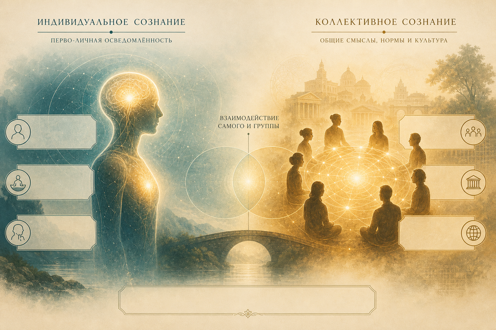
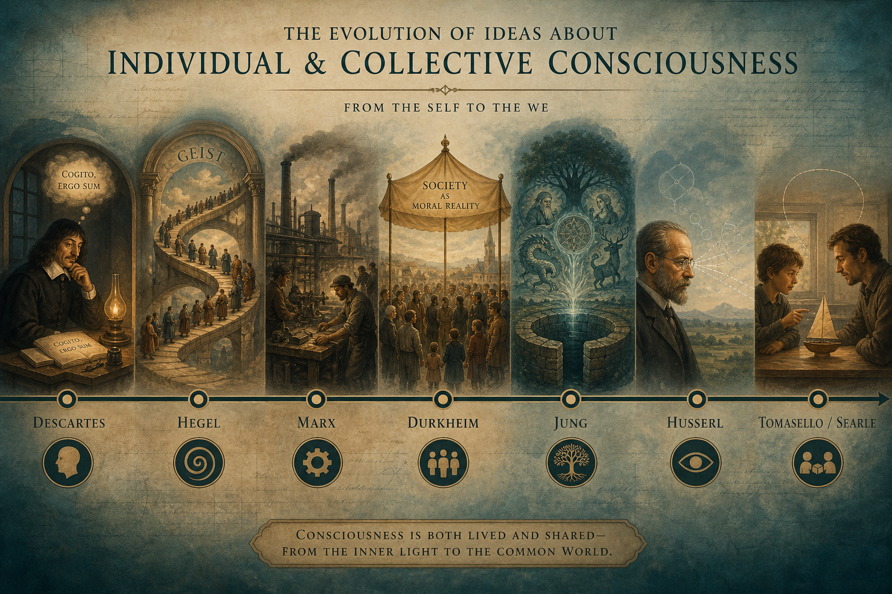
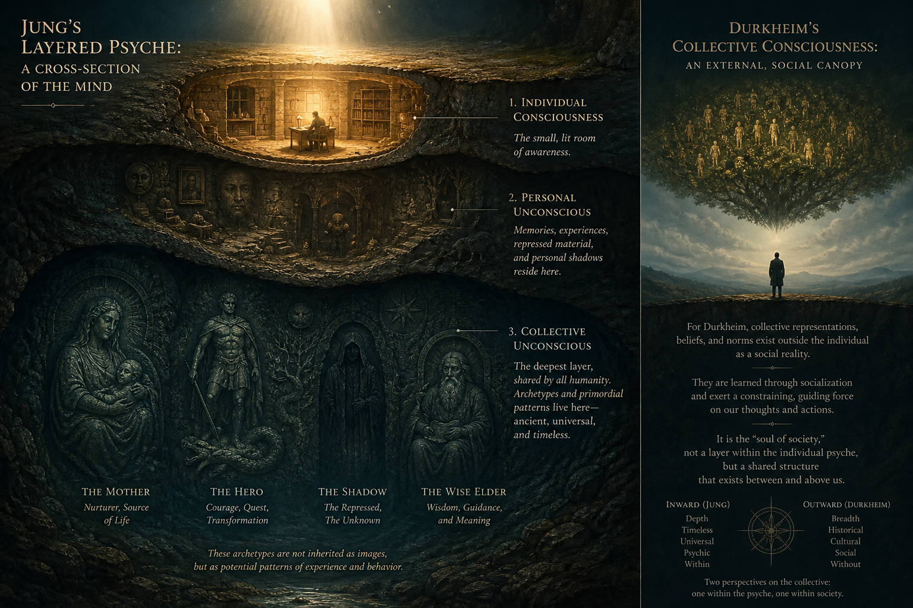
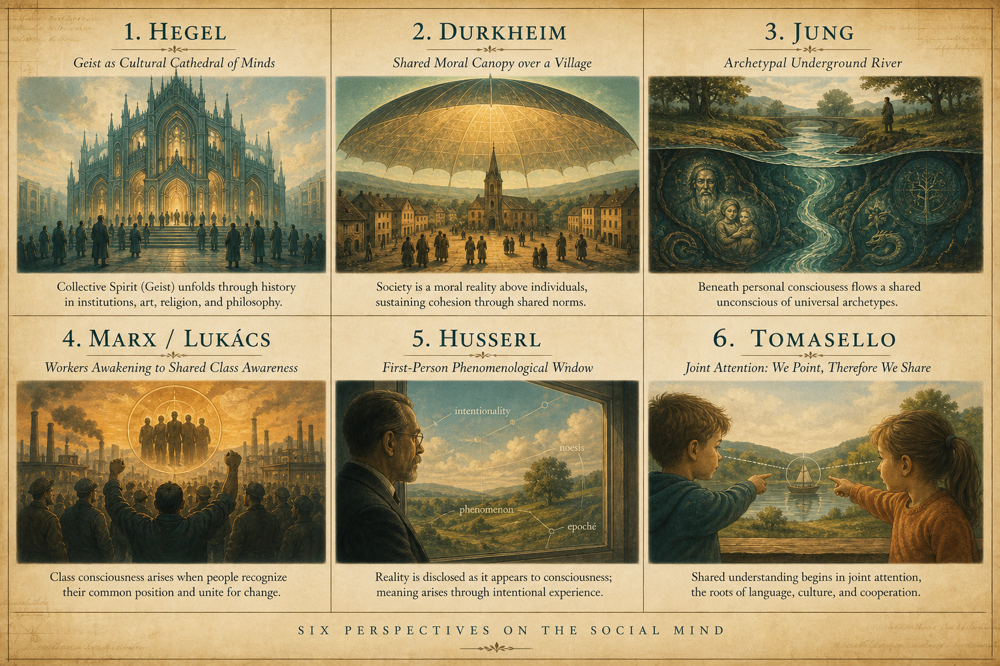
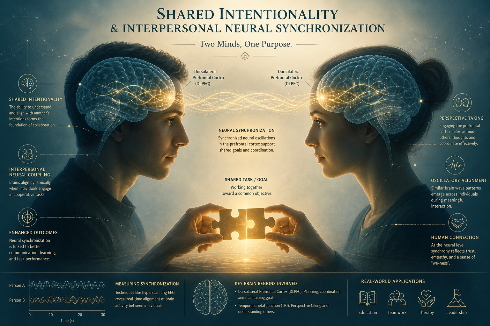
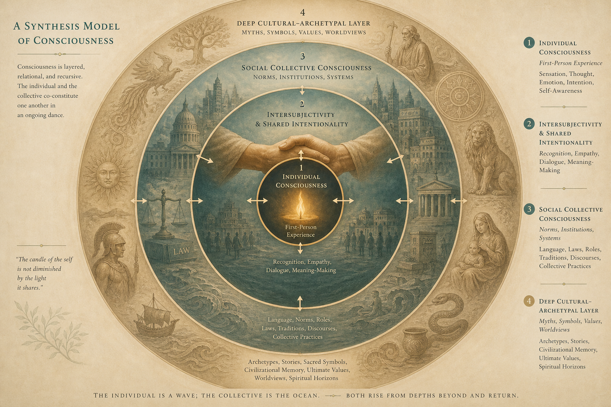

# Коллективное и индивидуальное сознание

**Реферат по философии сознания, социологии и психологии**

---

### Содержание

1. [Введение и постановка проблемы](#1-введение-и-постановка-проблемы)
2. [Ключевые термины](#2-ключевые-термины)
3. [Индивидуальное сознание: основные линии](#3-индивидуальное-сознание-основные-линии)
4. [Коллективное сознание: философские и научные концепции](#4-коллективное-сознание-философские-и-научные-концепции)
5. [Сравнительный анализ: общее и различное](#5-сравнительный-анализ-общее-и-различное)
6. [Современные исследования](#6-современные-исследования)
7. [Синтетическая модель](#7-синтетическая-модель)
8. [Выводы](#8-выводы)
9. [Источники](#9-источники)

---

## 1. Введение и постановка проблемы

Сознание кажется одновременно самым личным и самым общим из человеческих феноменов. С одной стороны, переживание «я вижу», «я чувствую», «я думаю» принадлежит только мне: никто другой не может занять мою точку зрения изнутри. С другой стороны, язык, мораль, религия, наука и повседневные институты существуют только потому, что смыслы разделяются многими людьми.

Отсюда центральный вопрос реферата:

> **Как связаны индивидуальное сознание и коллективные формы психической и социальной жизни?**  
> Является ли коллективное сознание лишь суммой индивидуальных умов, особой социальной реальностью, глубинным психическим слоем — или способом координации намерений?

Ответ зависит от того, из какой дисциплины смотреть. Философия сознания подчёркивает субъективность и «первое лицо». Социология — нормы и солидарность. Аналитическая психология — архетипы. Феноменология — интерсубъективность. Когнитивная наука — совместную интенциональность и нейронную синхронизацию.

*Илл. 1. Два полюса одного вопроса: приватное переживание «я» и общее поле смыслов «мы».*

---

## 2. Ключевые термины

| Понятие | Краткий смысл | Классические авторы |
|---|---|---|
| **Индивидуальное сознание** | Субъективный поток переживаний, данность от первого лица | Декарт, Локк, Гуссерль |
| **Коллективное сознание** (*conscience collective*) | Система общих верований, чувств и норм общества | Э. Дюркгейм |
| **Коллективное бессознательное** | Наследуемый глубинный слой психики с архетипами | К. Г. Юнг |
| **Дух / Geist** | Исторически развёртывающаяся самосознательная жизнь сообщества | Г. В. Ф. Гегель |
| **Классовое сознание** | Осознание группой своего положения и интересов | К. Маркс, Д. Лукач |
| **Интерсубъективность** | Конституция мира через отношение к другим субъектам | Э. Гуссерль, А. Шюц |
| **Коллективная / совместная интенциональность** | Способность разделять цели, внимание и нормы | Дж. Сёрл, М. Томаселло |

Важно не смешивать близкие, но разные термины. **Коллективное сознание** у Дюркгейма — социальный факт. **Коллективное бессознательное** у Юнга — психическая структура. **Коллективная интенциональность** у Сёрла и Томаселло — способность агентов совместно намереваться. Общее слово «коллективное» скрывает разные уровни анализа.

---

## 3. Индивидуальное сознание: основные линии

### 3.1. Классическая философия субъекта

В новоевропейской традиции сознание закрепляется как **внутренний, приватный факт**. У **Рене Декарта** достоверность начинается с *cogito*: мышление удостоверяет существование мыслящего. Сознание здесь — прозрачность для себя, опора знания и свободы.

У **Джона Локка** сознание связывается с личной идентичностью: человек остаётся тем же лицом, пока сохраняется непрерывность самосознания. Индивидуальное «я» мыслится как центр памяти и ответственности.

Эта линия задаёт сильную интуицию: **сознание первично индивидуально**, а общество — внешняя надстройка.

### 3.2. Феноменология: сознание как интенциональность

**Эдмунд Гуссерль** смещает акцент: сознание всегда есть *сознание-о-чём-то* (интенциональность). Оно не «вещь в голове», а направленность опыта. При этом Гуссерль различает:

- **чистое эго** — форма субъективности опыта, «моёсть» (*Meinheit*), которая не возникает из общества и не сливается с чужими потоками сознания;
- **личностное эго** — характер, убеждения, ценности, которые формируются в общении.

Следовательно, даже в строго субъективном подходе индивидуальность **не изолирована**: мир дан как общий через интерсубъективность. Но потоки сознания, по Гуссерлю, не сливаются в один сверхсубъект.

### 3.3. Научный взгляд на индивидуальный ум

В когнитивной науке и нейронауках индивидуальное сознание исследуется как:

- глобальное рабочее пространство внимания;
- интегрированная информация в нейронных системах;
- предиктивная модель мира, обновляемая через восприятие и действие.

Этот подход силён в объяснении механизмов одного мозга, но сам по себе слабо отвечает, **почему** человеческое сознание так глубоко культурно и нормативно.

---

## 4. Коллективное сознание: философские и научные концепции

*Илл. 2. Историческая карта идей: от картезианского «я» к социальным, психическим и когнитивным теориям «мы».*

### 4.1. Гегель: дух как «я, которое есть мы»

У **Гегеля** самосознание достигает истины не в одиночестве, а в признании другого. Формула *«Я, которое есть Мы, и Мы, которое есть Я»* означает: индивидуальность становится собой через формы совместной жизни — право, нравственность, государство, искусство, религию, философию.

**Geist** — не отдельная сверхдуша над людьми и не простая сумма индивидов. Это **форма жизни**: практики, институты и смыслы, в которых индивиды узнают себя как членов общего самосознания. История — процесс, где дух становится всё более прозрачным для себя.

### 4.2. Маркс и Лукач: сознание и материальные условия

**Карл Маркс** переворачивает гегелевскую схему: не идея творит мир, а общественное бытие определяет сознание. Сознание индивида отражает классовое положение, способ производства и господствующие идеологии.

У **Дьёрдя Лукача** (*История и классовое сознание*) появляется идея **классового сознания** как способности группы видеть тотальность общественных отношений. Это не просто сумма мнений рабочих, а потенциал коллективного субъекта истории. Критики (в том числе Адорно) предостерегали от чрезмерной идеализации единого коллективного агента.

### 4.3. Дюркгейм: коллективное сознание как социальный факт

**Эмиль Дюркгейм** дал классическое социологическое определение:

> Совокупность верований и чувств, общих средним членам общества, образует определённую систему, имеющую собственную жизнь.

Ключевые черты:

1. **Эмерджентность** — коллективное сознание не сводится к сумме индивидуальных психик.
2. **Внешность и принуждение** — нормы существуют до индивида и переживаются как обязательные.
3. **Солидарность** — в традиционных обществах коллективное сознание плотно и однородно (механическая солидарность); в сложных — разреженнее, уступая место разделению труда (органическая солидарность).
4. **Коллективные представления** — религия, право, мораль как общие символические формы.

Для Дюркгейма индивид свободен не вопреки коллективному, а **внутри морально организованного общества**.

### 4.4. Юнг: коллективное бессознательное

**Карл Густав Юнг** говорит не о социальных нормах, а о **глубинном слое психики**, общем всем людям:

- он **наследуем**, а не выучен;
- состоит из **архетипов** — предсуществующих форм опыта (Мать, Герой, Тень, Мудрый старец и др.);
- проявляется в снах, мифах, символах, искусстве.

Юнг отличает:

| Слой | Содержание |
|---|---|
| Сознание | Актуальные переживания «я» |
| Личное бессознательное | Вытесненное, забытое, индивидуальная история |
| Коллективное бессознательное | Универсальные архетипические структуры |

*Илл. 3. Модель психики: индивидуальное сознание — верхний свет; ниже — личная история; глубже — общий архетипический слой. Сбоку — «социальный купол» дюркгеймовских норм.*

Юнг и Дюркгейм часто сравниваются, но решают разные задачи: один объясняет **сцепление общества**, другой — **универсальность символического опыта**.

### 4.5. Сёрл и Томаселло: коллективная интенциональность

В аналитической философии и эволюционной антропологии акцент смещается на **как именно** индивиды создают общее.

- **Джон Сёрл**: социальные факты (деньги, брак, государство) существуют потому, что люди коллективно принимают их как имеющие статус. Формула: *X считается Y в контексте C*.
- **Майкл Томаселло**: отличие человека — **совместная интенциональность**: способность разделять цели, внимание и роли. Позже развивается **коллективная интенциональность** — нормы, конвенции, институты культурной группы.

Здесь коллективное не «над» индивидом как мистическая субстанция, а **в способе координации индивидуальных умов**.

---

## 5. Сравнительный анализ: общее и различное

*Илл. 4. Шесть оптик одного феномена: дух, социальный факт, архетип, класс, интерсубъективность, совместная интенциональность.*

### 5.1. Что общего у основных концепций

Несмотря на дисциплинарные различия, можно выделить устойчивые пересечения:

1. **Индивид не самодостаточен для объяснения смысла.** Язык, мораль, миф, право и наука предполагают более чем одного носителя сознания.
2. **Существует уровень «сверхиндивидуального» порядка.** У Гегеля это *Geist*, у Дюркгейма — социальный факт, у Юнга — архетипический слой, у Сёрла — институциональная реальность.
3. **Индивидуальное и коллективное взаимно конституируют друг друга.** Личность формируется в социализации; общество воспроизводится через действия и переживания индивидов.
4. **Символы и практики — мост между «я» и «мы».** Ритуал, закон, миф, жест, язык делают внутреннее разделяемым.
5. **Проблема свободы и зависимости.** Почти все концепции ставят вопрос: как сохранить автономию субъекта, признавая силу коллективных структур.

### 5.2. В чём принципиальные отличия

| Критерий | Индивидуалистская линия (Декарт → часть феноменологии) | Дюркгейм | Юнг | Гегель | Маркс / Лукач | Сёрл / Томаселло |
|---|---|---|---|---|---|---|
| **Онтологический статус коллективного** | Вторичен / производён | Реален как социальный факт | Реален как психический слой | Реален как форма духа | Реален как классовая практика/идеология | Реален как статусные функции и координация |
| **Где «живёт» коллективное** | В отдельных умах | В обществе и институтах | В глубинах психики каждого | В истории и культуре | В производственных отношениях и борьбе | В совместных намерениях и нормах |
| **Как возникает** | Из опыта субъекта | Из ассоциации и принуждения норм | Наследуется / архетипично | Через признание и развитие форм жизни | Через материальные условия и практику | Через эволюцию сотрудничества и культурное обучение |
| **Отношение к бессознательному** | Часто вторично | Есть, но не центрально | Центрально | Скорее «ещё-не-понятое» духа | Идеология / ложное сознание | Не ключевой термин |
| **Метод** | Интроспекция, анализ опыта | Социология социальных фактов | Аналитическая психология | Диалектика | Исторический материализм | Философия действия + эмпирическая антропология/нейронаука |
| **Риск крайности** | Солипсизм | Социологизм | Мистификация / биологизация | Метафизика сверхсубъекта | Редукция к классу | Редукция к координации без глубины смысла |

### 5.3. Три ключевые оппозиции

**1. Внешнее vs внутреннее.**  
Дюркгейм смотрит «снаружи»: нормы, статистика, право. Юнг — «изнутри»: сны, символы, индивидуация. Гегель и Гуссерль пытаются удержать оба края.

**2. Сознательное vs бессознательное.**  
Коллективное сознание Дюркгейма — то, что общество в значительной мере **знает и разделяет**. Коллективное бессознательное Юнга — то, что **действует, не будучи ясно осознанным**.

**3. Субстанция vs отношение.**  
Одни формулировки звучат субстанциально («коллектив имеет собственную жизнь»). Другие — реляционно («коллективное есть способ связанности индивидов»). Современная когнитивная наука ближе ко второму.

### 5.4. Особый случай: Дюркгейм и Юнг

Сравнение этих двух авторов особенно поучительно, потому что термины похожи, а содержание различно.

| | Дюркгейм | Юнг |
|---|---|---|
| Предмет | Социум | Психика |
| Ключевое понятие | *Conscience collective* | Collective unconscious |
| Источник общности | История группы, социализация | Видовая психическая наследственность |
| Проявление | Законы, мораль, религия как социальный культ | Мифы, сны, символы, искусство |
| Функция | Солидарность и интеграция | Индивидуация и психическая целостность |
| Отношение к индивиду | Индивид формируется обществом | Индивид несёт общее внутри себя и через него становится собой |

Общее у них: оба отвергают чистый атомизм «пустого» индивида и ищут структуры, превосходящие личный опыт. Различие: у Дюркгейма «общее» — **культурно-историческое**, у Юнга — **универсально-психическое**.

---

## 6. Современные исследования

### 6.1. Совместная интенциональность

Исследования Томаселло и коллег показывают: уже в раннем возрасте дети способны к **совместному вниманию** и сотрудничеству с разделением ролей. Большие обезьяны понимают цели других, но в меньшей степени мотивированы **делить** психические состояния. На этой способности вырастают язык, нормы и институты.

### 6.2. Межмозговая синхронизация

Гиперсканирующие исследования (одновременная запись активности двух и более мозгов) обнаруживают **interpersonal neural synchronization**: при совместной задаче усиливается согласование сигналов, особенно в префронтальных и темпоропариетальных областях. Это не доказывает существование «единого группового мозга», но показывает биологический коррелят совместной интенциональности.

*Илл. 5. Современный эмпирический образ коллективности: два индивидуальных сознания синхронизируются вокруг общей цели.*

### 6.3. Цифровая эпоха и трансформация коллективного

В сетевых медиа дюркгеймовское коллективное сознание меняет форму:

- нормы возникают быстрее и фрагментируются на сообщества;
- эмоциональное заражение усиливается алгоритмами внимания;
- появляется напряжение между глобальными платформами и локальными идентичностями.

Это не отменяет классические теории, но требует различать **культурную солидарность**, **массовое настроение** и **архитектуру внимания**.

---

## 7. Синтетическая модель

Ни одна из рассмотренных концепций не покрывает феномен целиком. Более плодотворна **многоуровневая схема**:

*Илл. 6. Концентрическая модель: от индивидуального «я» через совместность и институты к глубинным культурно-архетипическим слоям.*

1. **Ядро: индивидуальное сознание**  
   Первое лицо, качественный опыт, ответственность, свобода выбора. Без него нет носителя смысла.

2. **Кольцо интерсубъективности**  
   Взгляд другого, эмпатия, совместное внимание, диалог. Здесь рождается «мы» как живое отношение.

3. **Кольцо социального коллективного сознания**  
   Нормы, институты, роли, статусы (Дюркгейм, Сёрл). Это публично разделяемое и относительно осознаваемое.

4. **Внешнее кольцо глубинных форм**  
   Архетипы, большие нарративы, долговременные культурные гештальты (Юнг, отчасти Гегель). Они задают горизонт возможного смысла, часто действуя полуосознанно.

Стрелки двусторонние: индивид усваивает коллективное; коллективное обновляется действиями, кризисами и творчеством индивидов. Классовое сознание и политическая субъектность располагаются на стыке 2–3 колец: там, где группы осознают свои интересы и способны к совместному действию.

---

## 8. Выводы

1. **Индивидуальное и коллективное сознание — не альтернативы, а взаимодополняющие измерения.** Первое объясняет субъективность и ответственность; второе — устойчивость смыслов, норм и культуры.

2. **Главные традиции сходятся в одном:** чисто атомистическая модель «изолированного ума» недостаточна. Различаются они в том, *чем именно* является коллективное — социальным фактом, духом истории, архетипическим слоем, классовой практикой или координацией намерений.

3. **Наиболее частое смешение терминов** — между дюркгеймовским коллективным сознанием и юнговским коллективным бессознательным. Первое описывает **связь общества**, второе — **общую глубину психики**.

4. **Современная наука** сближает философские интуиции с эмпирией: совместная интенциональность и межмозговая синхронизация показывают, *как* индивидуальные сознания образуют рабочие формы «мы», не становясь одним сверхсубъектом.

5. **Практический вывод:** понимание человека требует двойной оптики. Без индивидуального сознания нельзя объяснить опыт и свободу; без коллективного — язык, мораль, институты и саму возможность понимать друг друга.

---

## 9. Источники

1. Durkheim É. *De la division du travail social* (1893); рус. пер.: *О разделении общественного труда*.  
2. Durkheim É. *Les formes élémentaires de la vie religieuse* (1912).  
3. Jung C. G. *The Archetypes and the Collective Unconscious* // CW 9/I.  
4. Hegel G. W. F. *Phänomenologie des Geistes* (1807).  
5. Marx K. *Zur Kritik der politischen Ökonomie* (1859); предисловие о базисе и надстройке.  
6. Lukács G. *Geschichte und Klassenbewußtsein* (1923).  
7. Husserl E. *Ideen zu einer reinen Phänomenologie…*; тексты об интерсубъективности (*Cartesianische Meditationen* и др.).  
8. Searle J. *The Construction of Social Reality* (1995).  
9. Tomasello M. et al. Understanding and sharing intentions: The origins of cultural cognition // *Behavioral and Brain Sciences*, 2005.  
10. Tomasello M. работы о joint / collective intentionality (2014–2024).  
11. Greenwood S. F. Emile Durkheim and C. G. Jung: Structuring a Transpersonal Sociology of Religion // *International Journal of Transpersonal Studies*, 2013.  
12. Fishburne D., Davis H. Putting our heads together: interpersonal neural synchronization as a biological mechanism for shared intentionality // *Social Cognitive and Affective Neuroscience*, 2018.  
13. Zahavi D. исследования интерсубъективности и личного эго (в т.ч. «We in Me or Me in We?»).  
14. Мештрович С. Г. и др. сравнительные работы по бессознательным аспектам у Дюркгейма.  

---

*Реферат подготовлен как обзорно-сравнительное исследование для материалов проекта Theory of the Game.*
